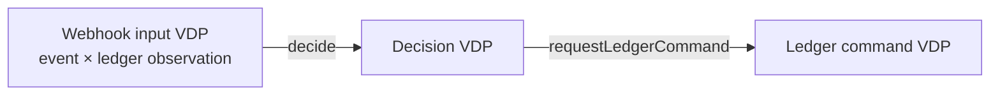

# ArchiScript: check architectural decisions before coding them

ArchiScript is a small Lean library for stating which inputs a design covers,
how it classifies them, and which operations may connect the resulting classes.
It is useful when several implementation decisions depend on the same boundary:
the model gives reviewers and AI coding agents a shared, checkable contract.

## A case the model catches

Imagine a form with an email field and a name field. An agent proposes two
states: `complete` (both filled) and `empty` (both blank). That sounds plausible
until someone submits only an email. That input has no stated meaning.

The [runnable FormInput model](ArchiScript/Examples/FormInput.lean) starts with
`String × String`, so all four presence combinations are in scope:

| Email | Name | Meaning |
| --- | --- | --- |
| blank | blank | both missing |
| filled | blank | name missing |
| blank | filled | email missing |
| filled | filled | complete |

It defines predicates for the meaningful regions and a partition that
classifies each input. The central check is `Partition.Realizes`: for **every**
input, does the classifier's answer agree with the independently stated meaning
of that member?

```lean
import ArchiScript.Examples.FormInput
open ArchiScript ArchiScript.Examples.FormInput

-- The four field-specific regions match the classifier.
example : fieldPartition.Realizes fieldRegions :=
  fieldPartition_realizes_regions
```

The [incomplete variant](Test/Negative/IncompleteMembers.lean) calls the second
member “both missing” while leaving the one-field-filled inputs out of its
stated regions. It cannot satisfy `Realizes`: `("a@example.test", "")` is
neither complete nor both missing. The [overlapping variant](Test/Negative/OverlappingMembers.lean)
also fails: “email provided” and “name provided” overlap when both are filled.
Run `bash scripts/check-negative.sh` to see Lean reject both obligations.

The model can then intentionally group all three incomplete cases into one
member for a consumer that only needs `complete` versus `incomplete`. Its
`forgetFieldFailures` operation maps the four detailed members to those two
members, and a theorem checks that this agrees with classifying the same raw
input at the coarser resolution:

| `fieldPartition` member | `forgetFieldFailures` → `formPartition` member |
| --- | --- |
| both missing | incomplete |
| name missing | incomplete |
| email missing | incomplete |
| complete | complete |

This operation maps **members**, not the input strings. It deliberately forgets
which field was missing.

**Why use ArchiScript here?** It supplies a common shape for this contract:
an explicit carrier, named semantic regions, finite nonempty partition members,
and typed operations between partitions. Lean checks the coverage and mapping
claims that the author states; ArchiScript adds the modeling vocabulary, not a
new proof engine. For a single two-field form, ordinary code and tests may be
enough. The value grows when several agents or components must agree on the
same distinctions and routes before implementation. This repository is a
modeling prototype, not a form validator or a runtime.

## Where the member maps pay off: payment webhook retries

Suppose a payment provider sends a `success` webhook twice. The event payload
is identical, but the first delivery should queue fulfillment and the retry
should not. The decision therefore needs both the event and a ledger snapshot
answering whether its ID is already recorded. In the
[PaymentWebhook model](ArchiScript/Examples/PaymentWebhook.lean), the input
carrier contains the raw event ID, raw status, and that ledger observation.
The `inputPartition` selects five semantic members from this carrier.



The arrows are ArchiScript operations: partial maps between **VDP members**.
They are architectural contracts, not calls that read or write the ledger.
Here are all their member mappings:

| `inputPartition` member | `decide` → decision member | `requestLedgerCommand` → ledger command member |
| --- | --- | --- |
| malformed ID | reject | `none` |
| unsupported status | ignore | `none` |
| failed payment | record failure | record failure |
| first successful delivery | fulfill | record payment and queue fulfillment |
| duplicate successful delivery | acknowledge duplicate | `none` |

This is the useful check across components. The input regions are stated
separately from the classifier, so `inputPartition.Realizes inputRegions` must
hold for every combination of event and ledger observation. In particular,
`("p1", "success", false)` and `("p1", "success", true)` have the same event but
belong to different members. An event-only classifier cannot satisfy those
regions. Then operation composition checks the downstream contract:

```lean
import ArchiScript.Examples.PaymentWebhook
open ArchiScript.Examples.PaymentWebhook

example : inputPartition.Realizes inputRegions :=
  inputPartition_realizes_regions

example : (requestLedgerCommand.comp decide) .firstSuccess =
    some .recordAndQueueFulfillment := first_success_requests_fulfillment

example : (requestLedgerCommand.comp decide) .duplicateSuccess = none :=
  duplicate_requests_no_ledger_command
```

If a later edit maps duplicate delivery to `fulfill`, the second theorem fails.
If an operation is connected to a partition with the wrong source or target,
its composition does not type check. That is what ArchiScript adds here: one
explicit set of distinctions and member maps that several implementation
steps can be checked against. The author still has to justify the carrier:
Lean cannot discover a real-world input omitted from it. `none` means no
*modeled ledger command*; it does not prove the handler has no side effects.
Actually recording an ID and queueing fulfillment atomically requires a
separate effect contract and implementation.

## Mathematical foundation in brief

- **Subdomain $S \subseteq B$:** a semantic region of any value domain
  $B \subseteq \mathcal V$, where $\mathcal V$ is the ambient universe of values.
  $B$ need not be a VDP carrier. The foundation permits a defining formula or
  an opaque subdomain; the current Lean API uses a `Domain α` predicate.
  Supporting subdomains can overlap and need not cover their base. For
  $S \subseteq U$, the relative complement $U \setminus S$ names what remains
  inside $U$.
- **Carrier $C$:** the nonempty value domain selected for one VDP
  (`Partition.Carrier` in Lean). It may be infinite. The author must justify
  that it includes the real inputs that matter.
- **Value-domain partition (VDP):** a finite family $\mathcal M$ of nonempty,
  disjoint subdomains whose union is $C$. Equivalently, it classifies every
  $x \in C$ into exactly one member. Lean's `Partition` represents members by
  finite indices and defines each member as a classifier fiber.
  `Partition.Realizes` checks that those fibers match separately stated semantic
  regions. Supporting subdomains can be grouped into a member; they do not
  have to form a tree.
- **Operation $f : \mathcal M_X \rightharpoonup \mathcal M_Y$:** a partial map
  from members of one VDP to members of another (`Operation X Y` in Lean).
  `none` means undefined; `some failureMember` is a defined mapping to a
  modeled failure. An operation maps members, not carrier values or runtime
  effects.

Compatible operations compose: `g.comp f` follows $X \to Y \to Z$ and is
undefined if either mapping is undefined. The webhook example above uses this
to check the result of two member maps together.

This approach follows the sibling design's
[purpose](../archiscript-docs/chapter-1/init-ai-proposal.md),
[mathematical foundation](../archiscript-docs/chapter-1/stage-1/foundation.tex),
and [boundary design](../archiscript-docs/chapter-1/stage-2/scope.md).
Its TypeScript syntax and proposed product capabilities are not the Lean API.

## Lean core

This repository contains a deliberately small Lean 4 frontend/proof library.
The public entry point is `ArchiScript.lean`:

- `ArchiScript.Partition`: value-domain predicates, relative complements, finite
  partitions (VDPs), and correspondence with selected semantic regions;
- `ArchiScript.Operation`: partial member functions, composition laws, and typed
  branch witnesses;
- `ArchiScript.ParameterizedPartition`: finite member-indexed specialization
  and routing data (PVDPs);
- `ArchiScript.Examples.FormInput`: overlapping subdomains and four-to-two-member
  coarsening on the same raw input carrier;
- `ArchiScript.Examples.PaymentWebhook`: event-plus-ledger classification and
  composed member maps for first and duplicate deliveries;
- `ArchiScript.Examples.UserRegistration`: a compact model with named new-user
  and existing-user branches.

`existingUserBranch_creates_no_user` is the main branch theorem. It requires a
branch-indexed `ExistingSelection` premise. Its no-creation conclusion follows
specifically from the explicit `store_preserved : after = before` assumption;
the member map alone makes no database claim. The branch-indexed
`NewUserCreation` contract instead supplies explicit absence-before and
presence-after assumptions. Consumers can use those fields directly.

`ArchiScript.Examples.UserRegistration` is an API/effect illustration using a
preclassified inductive carrier. It does not independently establish that the
carrier is adequate for raw user input; authoring decisions about that external
boundary must be justified separately.

Build and check the examples with:

```sh
lake build
bash scripts/check-negative.sh
lake env lean skills/archiscript/examples/CurrentApi.lean
```

The partition carrier may be infinite; only `MemberIndex` is finitely
enumerated. `Partition.member` is the actual semantic subdomain. Enumeration
entries are indices, not semantic members. `Partition.Relabeling` fixes the
carrier and its values while translating indices; `Partition.PartitionIso` may
also bijectively transport carrier values and therefore does not assert
partition equality.

`Operation.Registry` is the model scope for declaration identity. Each
`OperationName` resolves once to a typed source, target, partial map, and a
branch-name resolver. Raw partial maps can be extensionally equal without
having the same declaration identity. An alias is an ordinary definition that
reuses the same registry and `OperationName`; a new registry name is a new
declaration, even if its map happens to be equal.

Branch identity is exactly `(OperationName, BranchName)` within a registry.
The owning declaration resolves every branch name through one total function,
so a canonical identity cannot acquire conflicting endpoints or membership
proofs. Identically spelled branch names under distinct operation names remain
distinct.

Operation declarations accept responsibility tags via `owners : List String`.
`branchOwners name = none` inherits those tags; `some tags` replaces them for
that branch, including `some []` for explicitly unassigned responsibility.
`Registry.resolveBranchOwners` resolves the effective tags through the canonical
branch address, so aliases share ownership. These tags describe responsibility;
they do not assert effects, permissions, deployment, or state ownership.
They are separate from the docs' codomain-based source-file organization.

Write proofs that constrain the design: an invariant preserved across a path,
a routing distinction, or a contract consequence a consumer needs. Supply Lean's
required structure fields, but reuse the core's coverage, disjointness, and
composition laws. Do not add a named theorem for every definition, branch
mapping, or conjunction of premises. Short proofs are useful when they protect
a real requirement; proof length alone is not the criterion.

`ParameterizedPartition.Routed` maps each finite route alias directly to a
canonical registry `OperationName`; its typed outbound operation is derived
from that registry resolution and a source-coherence proof. `RoutingRelevant`
holds when some canonical operation is available in one specialization and not
another. Duplicate or renamed route aliases to the same operation do not
manufacture relevance. This avoids both arbitrary route keys and extensional
program equality. A constant specialization family alone is not
routing-relevant.

## Subdomains, resolution, and checks

In a particular Lean model, a subdomain is a `Domain` predicate over its chosen
base type, often a VDP carrier. Express containment by implication,
intersection by conjunction, and union by disjunction.
`Domain.relativeComplement parent excluded contained` requires containment
evidence and keeps the remainder inside its stated parent. Subdomain ancestry
can involve several parents, so a tree is only one possible explanatory view.

A VDP selects a finite set of nonempty, exhaustive, disjoint regions at the
resolution needed by its operations. Flat member declarations are legitimate.
`Partition.Realizes regions` checks that separately declared semantic regions
agree with the classifier fibers. Overlapping or incomplete regions cannot
satisfy that correspondence. This evidence stays outside the partition's data
and does not affect endpoint identity.

The `FormInput` example begins with two arbitrary strings, including empty
ones. The subdomains “email text provided” and “name text provided” overlap.
One VDP distinguishes all four presence combinations; another groups the three
incomplete combinations into one member. The example checks both sets of
semantic regions and the member map that forgets field-specific failure detail.
It models presence only, not email syntax or personal-name validity.

The original docs target `unjustified-generalization`: treating convenient
leaves as an exhaustive universe without a general law or explicit constructor
closure. Closed inductive domains remain legitimate. This is an authoring/review
check here, not an implemented automatic diagnostic. There is no missing-tree
warning. Lean still checks partition fields, region correspondence when supplied,
branch witnesses, and route sources; carrier adequacy remains a review obligation.
See the skill's [diagnostic guidance](skills/archiscript/references/lean-api.md#diagnostics).

Deliberate limitations: no parser, runtime, UI, reflective semantic linter,
observation knowledge model, carrier-level executable operation, or general recursive PVDP
language is included. Nested specialization is a finite two-level structure.

## AI authoring skill

The self-contained [`skills/archiscript`](skills/archiscript) directory teaches
AI coding agents how to author and review ArchiScript models using the current
Lean API. It introduces the purpose and categorical modeling approach,
carrier-first modeling and unjustified generalization, canonical branch
identity, ownership tags, routing criteria, proportionate proof obligations, a
current-API example, and a small manual evaluation set.

Install it locally by copying the complete directory into a supported skills
directory. This command refuses to overwrite an existing installation:

```sh
skill_target="${CODEX_HOME:-$HOME/.codex}/skills/archiscript"
if [ -e "$skill_target" ]; then
  echo "skill already exists: $skill_target" >&2
  exit 1
fi
mkdir -p "$(dirname "$skill_target")"
cp -R skills/archiscript "$skill_target"
```

Restart or reload the agent host if it only discovers skills at startup, then
request ArchiScript model authoring/review normally or invoke `$archiscript`
explicitly where supported. The installed skill has no runtime dependency on
this repository's sibling documentation or on tmux. Do not copy only
`SKILL.md`; its relative API and evaluation links expect the whole directory.

## License

This repository is licensed under the [Apache License 2.0](LICENSE).
For material owned by the project author, this grant also covers earlier
revisions of this repository, including commits created before `LICENSE` was
added.
