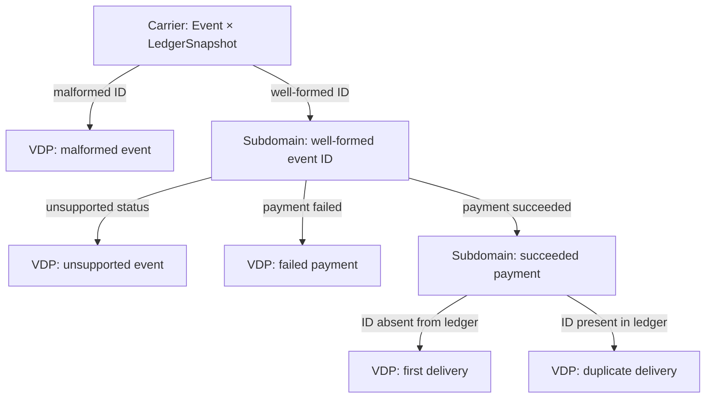
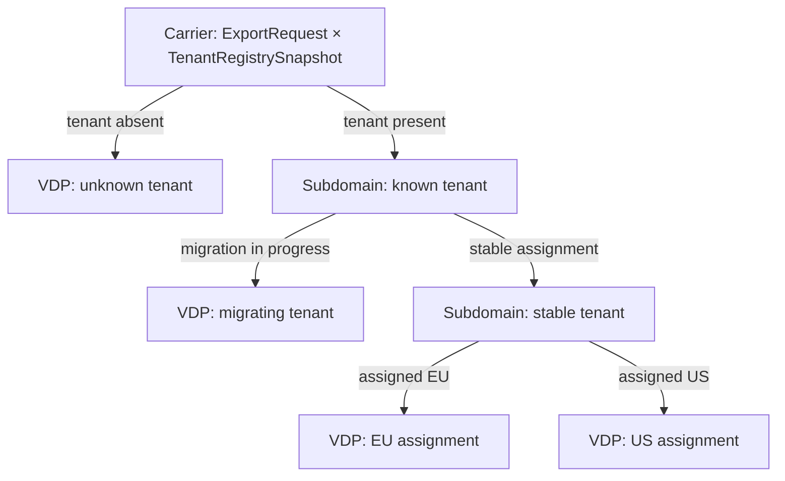

# ArchiScript: checked design for AI coding agents

ArchiScript is a formally checked design layer between requirements and
implementation. It helps AI coding agents expose the full input boundary,
derive the distinctions that matter, and check the resulting architectural
contracts before those choices become code. Lean checks the declared model;
choosing a carrier that truly represents the real boundary remains an authoring
and review obligation.

## Where the deduction finds a missing case

**Payment webhook retries.** A successful webhook can be a first delivery or
a retry. Both have the same event payload; the distinction depends on whether
its ID is already in the payment ledger. Starting with `Success | Failure` as
the entire input silently loses that fact. Start instead with the input to the
decision: the event *and* the relevant ledger snapshot.



The arrows in this diagram are **domain refinements**, not operations or a
runtime sequence. The intermediate nodes are supporting subdomains derived by
predicates and relative complements from their parents. The five leaves can
be selected as VDP members, or some can be grouped if a consumer needs fewer
distinctions. Suppose an agent declares only `failed`, `firstDelivery`, and
`duplicate` as members. Malformed and unsupported events are in the carrier
but in none of those *declared regions*. A proof that the classifier realizes
those regions fails. Likewise, classifying from the event payload alone cannot realize both
delivery regions: the same payload with two different ledger snapshots needs
two different members. Lean exposes the missing distinction once the carrier
and region meanings are stated. Recording the ledger ID and capturing money
atomically still needs an explicit effect contract.

**Tenant export during a region migration.** An export request contains a
tenant ID and perhaps a cached region hint. The authoritative tenant registry
may say EU, US, migrating, or unknown. Routing from the hint alone looks
reasonable until a tenant moves; two requests with the same hint can require
different outcomes.



Here the arrows again refine domains, and the VDP members are the four leaves.
`assigned EU` means the registry assigns EU, not merely that the request says
EU. If an agent lists only EU and US members, the unknown and migrating inputs
refute coverage of the declared regions. If it classifies by the request hint,
a request whose hint says EU but whose registry assignment says US refutes
`Partition.Realizes`. Once the members are correct, a route declared with the
US partition as its source cannot be attached to the EU specialization; Lean
checks that source match.

The key Lean obligation is correspondence between a classifier and *separately
stated* semantic regions:

```lean
import ArchiScript.Examples.FormInput
open ArchiScript ArchiScript.Examples.FormInput

-- The carrier includes empty and partly filled forms.
example : fieldPartition.Carrier = (String × String) := rfl

-- Derive "email present, name missing" inside the email-present parent.
def missingName : Domain Input :=
  Domain.relativeComplement emailProvided completeForm (fun _ h => h.1)

-- The selected semantic regions agree with all classifier fibers.
example : fieldPartition.Realizes fieldRegions :=
  fieldPartition_realizes_regions
```

By contrast, this proposed two-member VDP leaves out forms with exactly one
field filled. Its `Realizes` obligation is deliberately unprovable:

```lean
def incompleteRegions : formPartition.MemberIndex → Domain Input
  | true  => completeForm
  | false => fun x => ¬ emailProvided x ∧ ¬ nameProvided x

-- No proof of `formPartition.Realizes incompleteRegions` exists:
-- ("a@example.test", "") belongs to neither declared region.
```

The executable [FormInput model](ArchiScript/Examples/FormInput.lean) contains
that full proof. Its [incomplete](Test/Negative/IncompleteMembers.lean) and
[overlapping](Test/Negative/OverlappingMembers.lean) variants fail the same
obligation. The payment and export trees above illustrate how to apply it to
harder boundaries; they are not yet Lean models in this repository.

This is the deductive direction: justify a broad carrier, derive narrower
subdomains from predicates and complements, then select exhaustive, disjoint,
nonempty VDP members. Closed inductive types are valid when their constructors
really exhaust the boundary. Lean proves properties of the *declared* carrier;
it cannot discover that the author chose a carrier that already omitted a
real-world case. That choice is an explicit review obligation.

## The model: objects and arrows

Start with what values can exist at the system boundary and what distinctions
matter to its behavior. A value-domain partition (VDP) is an **object**: it
classifies every value in an independently specified carrier into exactly one
nonempty semantic member. The carrier may be infinite; its member set is finite.
Members are predicates/subdomains, not sample values or constructor names.

An operation is an **arrow** between objects: a partial function on their member
sets. For each source member it selects at most one target member. `none` means
the operation is undefined there; an explicitly modeled failure outcome is
instead `some failureMember`. If one source member needs several outcomes,
revisit its distinctions or expose the missing context. Naming an arrow
`validate` or `save` does not establish validation or persistence effects.

Composition asks whether contracts fit. For $f : X \rightharpoonup Y$ and
$g : Y \rightharpoonup Z$, `g.comp f` follows the path through the same middle
partition; it is undefined wherever either step is undefined. Identity preserves
each member, and associativity lets a path be regrouped without changing its
member mapping. This is the partial-function calculus of `Par(FinSet)`, applied
to VDP member sets. The core
proves these laws once; authors use them to check meaningful paths and compare
alternative routes when the requirements say those routes should agree.

Work from the outside in: identify supplied values and assumptions, define
subdomains through predicates, containment, intersections, and relative
complements, then choose the distinctions each VDP exposes and connect the
objects with arrows. Subdomains may overlap and need not exhaust their parent;
exhaustiveness and disjointness apply to the selected members of a VDP. Several
elementary regions can form one member at a coarser architectural resolution.
The subdomain relationships and operation graph describe semantics, not a call
schedule. A consumer's lack of knowledge about a value is not another semantic
member. Environmental observations need explicit context and contracts.

For example, a project locator starts from the supplied string/URI boundary.
Refine URI syntax, scheme, file/directory form, and required sibling files,
retaining failures at each split. Starting with only the three accepted locator
forms makes omitted failures invisible to Lean. A complete classifier proves
coverage of the declared carrier, not adequacy of that carrier for the real task.

This approach follows the sibling design's
[purpose](../archiscript-docs/chapter-1/init-ai-proposal.md),
[mathematical foundation](../archiscript-docs/chapter-1/stage-1/foundation.tex),
and [boundary design](../archiscript-docs/chapter-1/stage-2/scope.md).
Its TypeScript syntax and proposed product capabilities are not the Lean API.

## Lean core

This repository contains a deliberately small Lean 4 frontend/proof library.
The public entry point is `ArchiScript.lean`:

- `ArchiScript.Partition`: value-domain predicates, relative complements, finite
  partitions (VDPs), and correspondence with selected semantic regions;
- `ArchiScript.Operation`: partial member functions, composition laws, and typed
  branch witnesses;
- `ArchiScript.ParameterizedPartition`: finite member-indexed specialization
  and routing data (PVDPs);
- `ArchiScript.Examples.FormInput`: overlapping subdomains and four-to-two-member
  coarsening on the same raw input carrier;
- `ArchiScript.Examples.UserRegistration`: a compact model with named new-user
  and existing-user branches.

`existingUserBranch_creates_no_user` is the main branch theorem. It requires a
branch-indexed `ExistingSelection` premise. Its no-creation conclusion follows
specifically from the explicit `store_preserved : after = before` assumption;
the member map alone makes no database claim. The branch-indexed
`NewUserCreation` contract instead supplies explicit absence-before and
presence-after assumptions. Consumers can use those fields directly.

`ArchiScript.Examples.UserRegistration` is an API/effect illustration using a
preclassified inductive carrier. It does not independently establish that the
carrier is adequate for raw user input; authoring decisions about that external
boundary must be justified separately.

Build and check the examples with:

```sh
lake build
bash scripts/check-negative.sh
lake env lean skills/archiscript/examples/CurrentApi.lean
```

The partition carrier may be infinite; only `MemberIndex` is finitely
enumerated. `Partition.member` is the actual semantic subdomain. Enumeration
entries are indices, not semantic members. `Partition.Relabeling` fixes the
carrier and its values while translating indices; `Partition.PartitionIso` may
also bijectively transport carrier values and therefore does not assert
partition equality.

`Operation.Registry` is the model scope for declaration identity. Each
`OperationName` resolves once to a typed source, target, partial map, and a
branch-name resolver. Raw partial maps can be extensionally equal without
having the same declaration identity. An alias is an ordinary definition that
reuses the same registry and `OperationName`; a new registry name is a new
declaration, even if its map happens to be equal.

Branch identity is exactly `(OperationName, BranchName)` within a registry.
The owning declaration resolves every branch name through one total function,
so a canonical identity cannot acquire conflicting endpoints or membership
proofs. Identically spelled branch names under distinct operation names remain
distinct.

Operation declarations accept responsibility tags via `owners : List String`.
`branchOwners name = none` inherits those tags; `some tags` replaces them for
that branch, including `some []` for explicitly unassigned responsibility.
`Registry.resolveBranchOwners` resolves the effective tags through the canonical
branch address, so aliases share ownership. These tags describe responsibility;
they do not assert effects, permissions, deployment, or state ownership.
They are separate from the docs' codomain-based source-file organization.

Write proofs that constrain the design: an invariant preserved across a path,
a routing distinction, or a contract consequence a consumer needs. Supply Lean's
required structure fields, but reuse the core's coverage, disjointness, and
composition laws. Do not add a named theorem for every definition, branch
mapping, or conjunction of premises. Short proofs are useful when they protect
a real requirement; proof length alone is not the criterion.

`ParameterizedPartition.Routed` maps each finite route alias directly to a
canonical registry `OperationName`; its typed outbound operation is derived
from that registry resolution and a source-coherence proof. `RoutingRelevant`
holds when some canonical operation is available in one specialization and not
another. Duplicate or renamed route aliases to the same operation do not
manufacture relevance. This avoids both arbitrary route keys and extensional
program equality. A constant specialization family alone is not
routing-relevant.

## Subdomains, resolution, and checks

A subdomain describes one region of a carrier. In Lean, use a named `Domain`
predicate; express containment by implication, intersection by conjunction, and
union by disjunction. `Domain.relativeComplement parent excluded contained`
requires containment evidence and keeps the remainder inside its stated parent.
Subdomain ancestry can involve several
parents, so a tree is only one possible explanatory view.

A VDP selects a finite set of nonempty, exhaustive, disjoint regions at the
resolution needed by its operations. Flat member declarations are legitimate.
`Partition.Realizes regions` checks that separately declared semantic regions
agree with the classifier fibers. Overlapping or incomplete regions cannot
satisfy that correspondence. This evidence stays outside the partition's data
and does not affect endpoint identity.

The `FormInput` example begins with two arbitrary strings, including empty
ones. The subdomains “email text provided” and “name text provided” overlap.
One VDP distinguishes all four presence combinations; another groups the three
incomplete combinations into one member. The example checks both sets of
semantic regions and the member map that forgets field-specific failure detail.
It models presence only, not email syntax or personal-name validity.

The original docs target `unjustified-generalization`: treating convenient
leaves as an exhaustive universe without a general law or explicit constructor
closure. Closed inductive domains remain legitimate. This is an authoring/review
check here, not an implemented automatic diagnostic. There is no missing-tree
warning. Lean still checks partition fields, region correspondence when supplied,
branch witnesses, and route sources; carrier adequacy remains a review obligation.
See the skill's [diagnostic guidance](skills/archiscript/references/lean-api.md#diagnostics).

Deliberate limitations: no parser, runtime, UI, reflective semantic linter,
observation knowledge model, carrier-level executable operation, or general recursive PVDP
language is included. Nested specialization is a finite two-level structure.

## AI authoring skill

The self-contained [`skills/archiscript`](skills/archiscript) directory teaches
AI coding agents how to author and review ArchiScript models using the current
Lean API. It introduces the purpose and categorical modeling approach,
carrier-first modeling and unjustified generalization, canonical branch
identity, ownership tags, routing criteria, proportionate proof obligations, a
current-API example, and a small manual evaluation set.

Install it locally by copying the complete directory into a supported skills
directory. This command refuses to overwrite an existing installation:

```sh
skill_target="${CODEX_HOME:-$HOME/.codex}/skills/archiscript"
if [ -e "$skill_target" ]; then
  echo "skill already exists: $skill_target" >&2
  exit 1
fi
mkdir -p "$(dirname "$skill_target")"
cp -R skills/archiscript "$skill_target"
```

Restart or reload the agent host if it only discovers skills at startup, then
request ArchiScript model authoring/review normally or invoke `$archiscript`
explicitly where supported. The installed skill has no runtime dependency on
this repository's sibling documentation or on tmux. Do not copy only
`SKILL.md`; its relative API and evaluation links expect the whole directory.

## License

This repository is licensed under the [Apache License 2.0](LICENSE).
For material owned by the project author, this grant also covers earlier
revisions of this repository, including commits created before `LICENSE` was
added.
