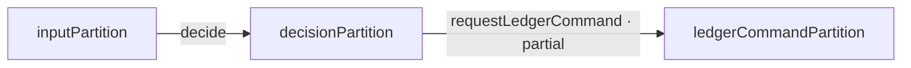
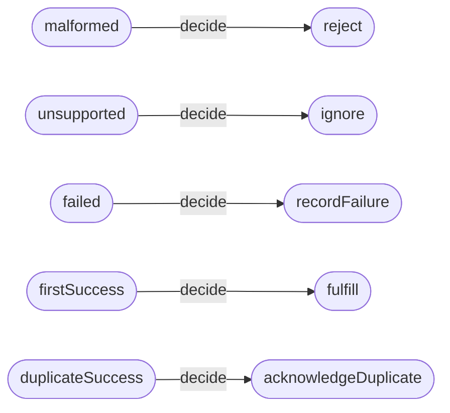
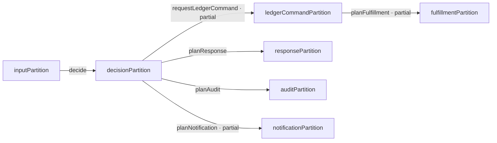
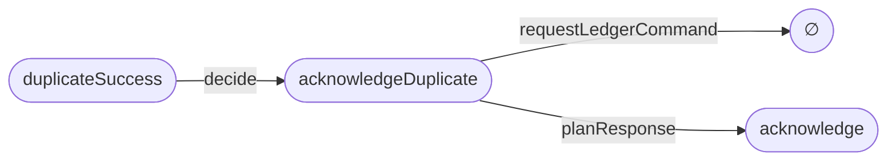
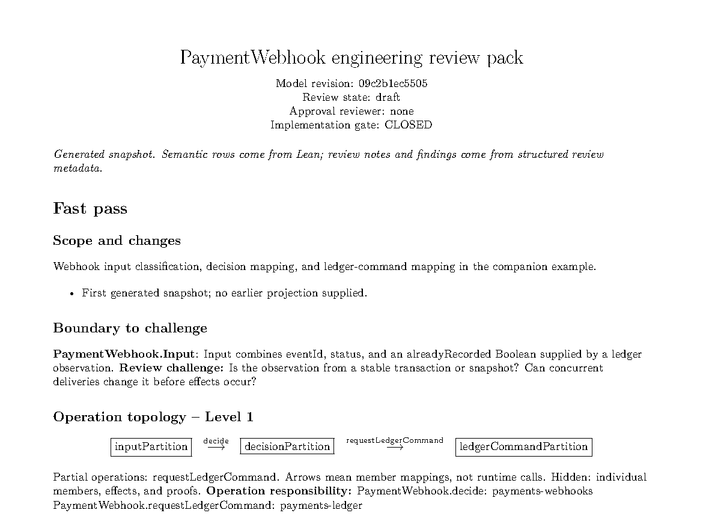

# ArchiScript

**Machine-checked software design for human review before AI writes code.**

**AI proposes. Lean checks. Engineers review. AI implements.** ArchiScript sits
between a requirement and the code an AI agent writes. It makes the assumed
input boundary, semantic cases, branch decisions, responsibilities, and intended
code locations explicit. Lean checks claims over that declared model. Engineers
review the decisions Lean cannot make, then implementation agents work from
approved canonical branches.

**Explore the working example:** [review PDF](review/generated/PaymentWebhook.pdf)
· [generated Mermaid views](review/generated/PaymentWebhook.md)
· [seven-VDP showcase](review/generated/PaymentWebhookNetwork.md)
· [Lean model](ArchiScript/Examples/PaymentWebhook.lean)
· [bound implementation](examples/payment-webhook.mjs)

```text
requirement → AI architecture agent → ArchiScript model → Lean checks
            → human review pack → approval or requested changes
            → implementation agents → code and evidence
```

An agent can write consistent code for an incomplete understanding of a problem.
For “handle successful payment webhooks idempotently,” a plausible model is
`success → fulfill`. It misses that a first delivery and a retry carry the same
event status but need different decisions. The input boundary needs an event
**and** a ledger observation. Whether that observation stays valid during
concurrent deliveries then becomes a question for an engineer, rather than a
hidden coding assumption.

## Three modeling rules

1. **A carrier is not justified by the cases you want to handle.** Coverage
   applies to the carrier the author declared. The author must also explain why
   that carrier represents the real boundary. A union of successful cases can
   exclude malformed or unsupported input before checking begins.
2. **A semantic name is not a semantic definition.** Names help people read a
   model; predicates establish membership. Define each meaningful region from
   a justified base, including any containment, relative complement, or fixed
   environmental context it depends on.
3. **A classifier is not evidence for its own meaning.** The predicates used to
   justify a partition must be stated independently of its classifier or
   `Partition.member` fibers. Proving agreement with regions defined as those
   same fibers adds no independent semantic evidence.

These rules guide the [AI skill](skills/archiscript/SKILL.md). Lean can check a
precise claim even when the claim omits a real-world case.

## Worked example: payment webhook retries

The [PaymentWebhook model](ArchiScript/Examples/PaymentWebhook.lean) declares an
input with `eventId : String`, `status : String`, and
`alreadyRecorded : Bool`. The Boolean represents a ledger observation supplied
to the model. The model does not establish how that observation is obtained or
kept stable. Its carrier is the whole `Input` type: empty IDs, unsupported
statuses, and both ledger outcomes remain possible.

The input partition selects five members. Their predicates are stated
separately from the classifier:

| Canonical member | Semantic membership condition |
| --- | --- |
| `malformed` | `eventId = ""` |
| `unsupported` | `eventId ≠ "" ∧ status ≠ "success" ∧ status ≠ "failed"` |
| `failed` | `eventId ≠ "" ∧ status = "failed"` |
| `firstSuccess` | `eventId ≠ "" ∧ status = "success" ∧ alreadyRecorded = false` |
| `duplicateSuccess` | `eventId ≠ "" ∧ status = "success" ∧ alreadyRecorded = true` |

These definitions let an engineer challenge whether an empty ID is the right
malformed criterion, whether other statuses need separate handling, or whether
a Boolean ledger observation is sound under concurrency. The predicates are
precise; the boundary justification remains an engineering judgment.

The checked architecture connects three value-domain partitions (VDPs):



**Level 1 · Operation topology.** This is an excerpt from the
[generated Markdown review pack](review/generated/PaymentWebhook.md), which
projects the Lean operation registry. It hides members, effects, and proofs.

These arrows map **semantic members**, not runtime calls. The two operations
yield this path table:

| Input member | `decide` target | `requestLedgerCommand` target |
| --- | --- | --- |
| `malformed` | `reject` | `none` |
| `unsupported` | `ignore` | `none` |
| `failed` | `recordFailure` | `recordFailure` |
| `firstSuccess` | `fulfill` | `recordAndQueueFulfillment` |
| `duplicateSuccess` | `acknowledgeDuplicate` | `none` |



**Level 2 · `decide` branch map.** The review builder derives every arrow from
the canonical branch registry. The table above adds the partial downstream
ledger mapping; `none` means that operation is undefined for the member.

`Partition.Realizes` checks that every carrier value is classified into the
member whose independently stated predicate it satisfies. Composition proofs
check the first-success and duplicate-success paths. A change that maps
`duplicateSuccess` to `fulfill` breaks the duplicate path theorem.

```lean
import ArchiScript.Examples.PaymentWebhook
open ArchiScript.Examples.PaymentWebhook

example : inputPartition.Realizes inputRegions :=
  inputPartition_realizes_regions

example : (requestLedgerCommand.comp decide) .duplicateSuccess = none :=
  duplicate_requests_no_ledger_command
```

Here `none` says only that **this ledger-command operation is undefined** for
`acknowledgeDuplicate`. It says nothing about logging, metrics, another store,
or a queue call in production code. If absence of runtime effects matters,
state an effect contract and inspect its implementation.

### From branch to code

Each defined branch has a canonical `(OperationName, BranchName)` address.
Responsibility and implementation location are separate facts:

| Fact | `PaymentWebhook.decide.duplicateSuccess` |
| --- | --- |
| Semantic mapping | `duplicateSuccess → acknowledgeDuplicate` |
| Responsibility | `payments-webhooks` |
| Primary implementation | [examples/payment-webhook.mjs](examples/payment-webhook.mjs), symbol `decide` |
| Supporting implementation | same file, symbol `handleWebhook` |
| Binding state | resolved in the companion example |
| Evidence reference | [Node tests](examples/payment-webhook.test.mjs) for duplicate acknowledgment without ledger or queue effects |
| Remaining question | ledger observation and effects under concurrent delivery |

A `SourceRef` identifies a repository, path, and optional symbol. Line ranges
and revision are navigation metadata. A resolved binding declares an
implementation site; it is **not** a proof of code conformance. The companion
tests exercise selected behavior, but do not prove transactional atomicity or
that every production environment follows the model.

## A connected seven-VDP review

The [PaymentWebhookNetwork model](ArchiScript/Examples/PaymentWebhookNetwork.lean)
extends the checked webhook decision with provider-response, audit,
notification, and fulfillment-request plans. Each plan is a separate
architectural obligation. An arrow still means a member mapping, never a
runtime call or proof that an effect occurred.

The [generated multi-view showcase](review/generated/PaymentWebhookNetwork.md)
starts with this Level 1 topology, exported from six canonical Lean operations:



The same generated artifact lets a reviewer narrow the question to one path:



Here the duplicate has a provider-response plan and no ledger-command mapping.
The [full showcase](review/generated/PaymentWebhookNetwork.md) also shows the
`decisionPartition` neighborhood, every `planNotification` branch including
undefined cases, input-region descriptions, branch-to-code bindings, proofs,
and open findings. The new code locations are **planned**; this expanded model
is **draft** and has no engineering approval. Its diagrams do not claim
production effects or conformance.

This compact Lean example keeps several VDPs in one file. The original
[Stage 2 source design](../archiscript-docs/chapter-1/stage-2/scope.md#one-architectural-pvdp-per-source-file)
requires one root (P)VDP per `.archi.ts` file and places each ordinary operation
with its codomain. The current Lean prototype has no declaration-file linker;
the showcase demonstrates review projections, not a replacement source layout.

## Engineering review is a gate

Lean can establish consistency of the declared model. It cannot decide whether
the boundary matches the real system, whether a distinction is useful, whether
responsibility is sensible, or whether the observation and effects are safe.
Engineers review a human-readable projection before architecture-driven
implementation. They can request changes against canonical IDs such as
`PaymentWebhook.inputPartition` or
`PaymentWebhook.decide.duplicateSuccess`.

The generated [PDF review pack](review/generated/PaymentWebhook.pdf) is a bounded
reading snapshot. Its [Markdown version](review/generated/PaymentWebhook.md)
includes the Mermaid diagrams shown above. A fast pass shows scope, boundary, topology,
major assumptions, and open questions. A deep pass shows semantic descriptions,
branch mappings, undefined outcomes, bindings, proof references, effects, and
findings. [Structured review metadata](review/payment-webhook.review.json)
holds object-addressed findings and review state; the PDF is not the review
database. The generator can compare a new snapshot with an earlier one and
report semantic changes.

[](review/generated/PaymentWebhook.pdf)

*The first page of the generated PDF for model revision `09c2b1ec5505`,
rasterized for this README. Select it to open the full review pack.*

The prototype recognizes `draft`, `ready-for-review`, `changes-requested`,
`approved`, and `superseded`. Approval is tied to a named reviewer and model
revision with no open findings. The PaymentWebhook pack is currently **draft**;
its implementation gate is **closed**. Two open findings ask for the ledger
observation boundary and record/queue recovery behavior. The companion code is
an experiment, not evidence of engineering approval for this architecture.

Review diagrams have focused levels: system context, operation topology,
one-operation branch map, semantic partition, and implementation/evidence path.
One view should answer one review question. Tables often explain branch mappings
better than graphs. The [diagram guide](skills/archiscript/references/review-diagrams.md)
and [review-pack guide](skills/archiscript/references/review-packs.md) specify
these projections. A reviewer unfamiliar with Lean should be able to dispute a
boundary, predicate, branch, owner, code site, effect assumption, or unsupported
claim without opening a `.lean` file.

## Keep claims at their actual evidence level

| Layer | What this example establishes |
| --- | --- |
| Architecture | **PROVED:** the input classifier realizes its declared regions; the two named composition paths have the stated results. |
| Carrier adequacy | **REVIEW FINDING:** ledger-observation consistency and scope need engineering judgment. |
| Implementation binding | **RESOLVED:** defined branches point to symbols in the companion code. |
| Code conformance | **PARTIAL EVIDENCE:** named tests cover selected behavior; no general conformance proof. |
| Runtime effects | **UNKNOWN:** atomic record/queue behavior and concurrent retries. |

A theorem about a branch may be **CONDITIONAL** on an explicit effect premise.
That premise must not be reported as proved about production code. The project
keeps `PROVED`, `CONDITIONAL`, review findings, and `UNKNOWN` distinct in agent
reports and review artifacts.

## How the model works

The authoring path is: justify the boundary, declare its carrier, define
semantic subdomains, select a VDP resolution, classify carrier values, and prove
correspondence. Only then should agents add operations, canonical branches,
responsibility, implementation disposition, and effect or value obligations.

A **subdomain** is a predicate over a meaningful base domain. Supporting
subdomains may overlap and need not exhaust that base. A **VDP** selects a finite
set of nonempty, disjoint members that exhausts its carrier. Several VDPs can
expose different resolutions of the same carrier; coarsening deliberately
forgets distinctions. The smaller [FormInput example](ArchiScript/Examples/FormInput.lean)
shows four field-presence cases grouped into `complete` and `incomplete`.
The [negative examples](Test/Negative) show failed correspondence for missing
and overlapping selected regions.

Lean's `Partition` represents a VDP with finite member indices and a
classifier. `Partition.Realizes` checks its classifier fibers against separately
defined semantic predicates. This correspondence is part of the normal
authoring and review path, although the current API stores it as a theorem
rather than inside a `CheckedPartition` structure. A `Domain α` is a predicate;
`Domain.relativeComplement` defines a remainder within an explicit parent.

An `Operation X Y` is a partial function between the **member sets** of VDPs
`X` and `Y`. A `some failureMember` mapping is defined; `none` is undefined.
Compatible operations compose, and undefinedness propagates. These are
architectural maps, not value-level handlers or execution schedules. The
[mathematical foundation](../archiscript-docs/chapter-1/stage-1/foundation.tex)
and [Stage 2 design](../archiscript-docs/chapter-1/stage-2/scope.md) explain
the underlying subdomains, partitions, observation, and operation discipline.
The older design uses TypeScript notation; the Lean source defines this
repository's current API.

## What is available in this unreleased version

| Available now | Scope |
| --- | --- |
| Lean model checks | Partitions, supplied semantic correspondence, member maps, typed composition, branches, and finite routing. |
| Canonical registry | Enumerable declared operations and branches, effective responsibility and implementation disposition, missing-metadata queries, and reverse navigation from a declared source identity. |
| Review protocol | Object-addressed findings, revision-specific approval state, diagram guidance, and a generated PaymentWebhook PDF/Markdown review pack with semantic snapshot diff. |
| Multi-VDP showcase | A second checked webhook model with seven VDPs, six operations, and generated topology, neighborhood, path, branch, semantic, and binding views. |
| Implementation experiment | A companion PaymentWebhook handler and selected Node tests with evidence references. |

The review exporter and PDF generator are currently **PaymentWebhook-specific**;
there is no general Review IR renderer yet. The registry does not inspect source
files for stale symbols or prove conformance. The Lean core does not infer
carrier adequacy, emit `unjustified-generalization` diagnostics automatically,
model temporal concurrency, or prove code effects. There is no parser, runtime,
or review UI. `ParameterizedPartition` supports finite member-indexed
specialization and routing, rather than the general recursive language of the
original design.

The pack currently displays human descriptions stored beside the Lean input
predicates. Lean checks the predicates against the classifier; it does not
verify that the English descriptions faithfully translate those predicates.

The [AI skill](skills/archiscript/SKILL.md) is part of this workflow. In
authoring mode it requires boundary justification, independent semantic
definitions, correspondence, explicit assumptions, and a human review pack.
In implementation mode it resolves approved canonical branches to code,
preserves the reviewed contract, records evidence, and reports remaining
unknowns. The skill carries reasoning discipline that Lean cannot currently
enforce automatically.

## Why these pieces are separate

- **A flowchart** can show a route; ArchiScript operations state typed partial
  mappings between semantic member sets. A semantic arrow is not a runtime call.
- **Tests** exercise selected implementations; they do not justify an input
  boundary or independently define every architectural case.
- **Types** constrain values; they need not state a chosen semantic resolution,
  branch identity, composition obligation, responsibility, or code binding.
- **Broader formal tools** can analyze behaviors beyond this calculus.
  ArchiScript's hypothesis is narrower: a reviewable design contract connected
  directly to AI implementation work. Predicates, partitions, and partial
  functions themselves are established mathematics.

## The experiment

Does requiring a checked, human-reviewed design before AI implementation reduce
omitted cases, hidden assumptions, inconsistent branches, wrong code locations,
model/code drift, and rework without making review too costly? The comparison
is `requirement → AI → code` against `requirement → AI → ArchiScript → Lean →
engineer review → AI implementation → evidence`. The PaymentWebhook companion
model is a first test case, not proof that this workflow succeeds in general.

## Build and use

```sh
lake build
bash scripts/check-negative.sh
lake env lean skills/archiscript/examples/CurrentApi.lean
node --test examples/payment-webhook.test.mjs
uv run --no-project python scripts/build-review-pack.py
uv run --no-project python scripts/build-webhook-network-showcase.py
```

The public Lean entry point is [ArchiScript.lean](ArchiScript.lean). The
[Lean API guide](skills/archiscript/references/lean-api.md) covers registry
identity, bindings, routing, and effect contracts. To compare review revisions,
run the pack builder with `--previous path/to/PaymentWebhook.snapshot.json`.

Install the complete skill directory into a supported skills location. This
command refuses to overwrite an existing installation:

```sh
skill_target="${CODEX_HOME:-$HOME/.codex}/skills/archiscript"
if [ -e "$skill_target" ]; then
  echo "skill already exists: $skill_target" >&2
  exit 1
fi
mkdir -p "$(dirname "$skill_target")"
cp -R skills/archiscript "$skill_target"
```

Restart or reload the agent host if it discovers skills only at startup, then
request ArchiScript work normally or invoke `$archiscript` explicitly where
supported.

## License

This repository is licensed under the [Apache License 2.0](LICENSE). For
material owned by the project author, this grant also covers earlier revisions
of this repository, including commits created before `LICENSE` was added.
