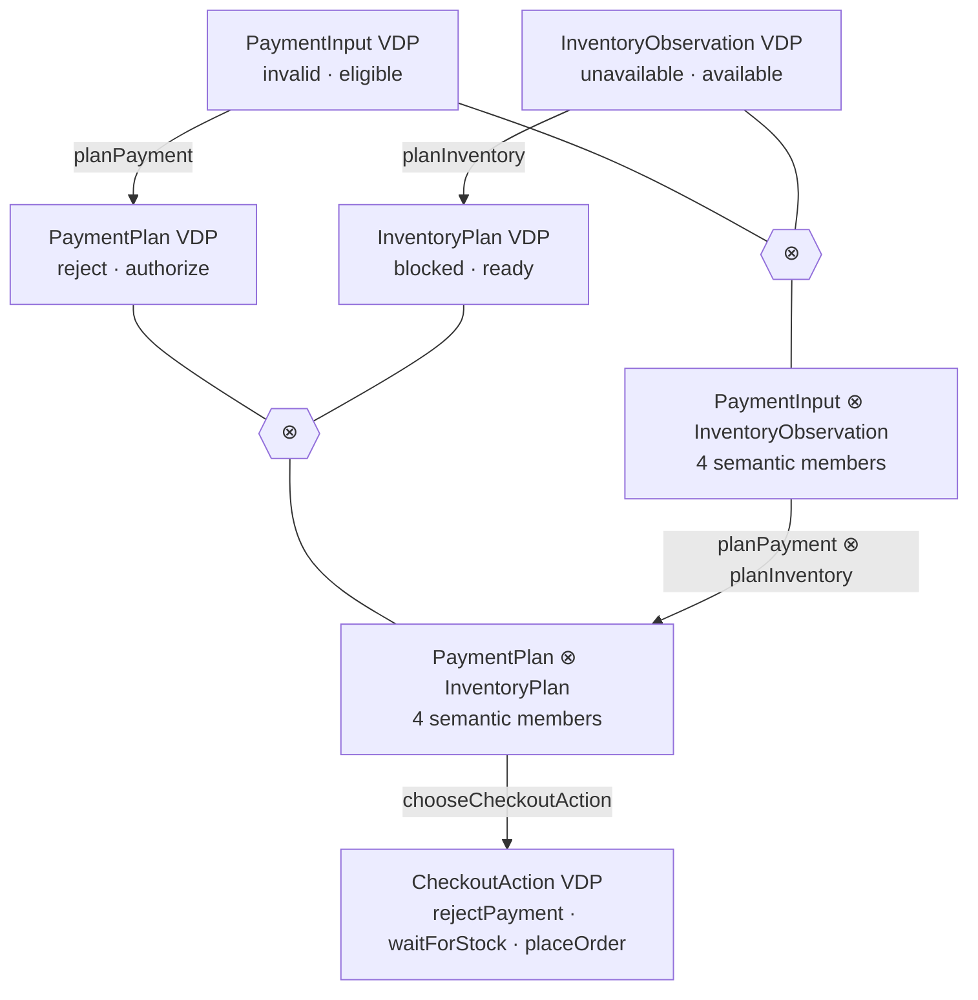
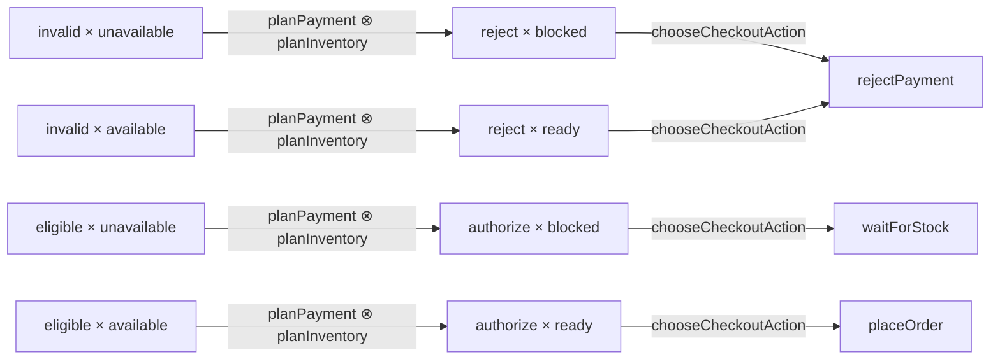

# ArchiScript

**Machine-checked software design for human review before AI writes code.**

ArchiScript is a Lean library and an authoring discipline for making software
architecture precise before implementation. An AI agent proposes the carrier,
semantic distinctions, operations, independent factors, assumptions, and open
questions. Lean checks the formal obligations of that declared model. Engineers
then decide whether the model is adequate for the real system.

Current release: **0.3.0**.

## What ArchiScript is for

Architecture work often fails before code exists: an input case is omitted, a
piece of preexisting state is treated as if it were part of the request, two
branches that need different outcomes are merged, a partial operation is
mistaken for a runtime effect, or two independently available inputs are combined
without anyone asking why.

ArchiScript gives those choices explicit mathematical objects:

- a **carrier** is the full value universe considered at one architectural
  boundary;
- a **domain** is a semantic predicate over a carrier;
- a **VDP** (value-domain partition) selects finitely many nonempty, disjoint,
  exhaustive semantic members;
- an **operation** is a partial function between VDP member sets;
- sequential composition is ordinary operation composition;
- independent composition is the VDP tensor introduced in 0.3.0;
- review metadata records provenance, responsibility, implementation bindings,
  evidence, assumptions, and approval separately from the calculus.

The core workflow is:

$
\text{requirements}
\rightarrow
\text{AI architecture proposal}
\rightarrow
\text{Lean obligations}
\rightarrow
\text{human review}
\rightarrow
\text{implementation}
$

Lean is **not** an architecture search engine and not a general model checker.
It is the executable implementation of necessary correctness criteria for the
model that was declared. A successful proof says that those criteria hold
relative to the chosen carrier, predicates, mappings, assumptions, and scope. It
does not prove that the author chose the right carrier, included every real-world
requirement, or that production code conforms.

## A motivating example

Suppose a payment webhook contains:

```json
{"eventId":"p1","status":"success"}
```

Whether that event should trigger fulfillment may also depend on preexisting
ledger state:

```json
{"alreadyRecorded":false}
```

The architectural input is therefore not just the payload. It is a product:

$
\text{WebhookPayload}\times\text{LedgerObservation}.
$

Two values with the same payload can legitimately belong to different semantic
members:

```text
success + alreadyRecorded = false  -> firstSuccess
success + alreadyRecorded = true   -> duplicateSuccess
```

The checked example in
[ArchiScriptExamples/PaymentWebhook.lean](ArchiScriptExamples/PaymentWebhook.lean)
selects five members over the full carrier:

```text
malformed
unsupported
failed
firstSuccess
duplicateSuccess
```

and maps them through architectural decisions:

```text
inputPartition
    |
    | decide
    v
decisionPartition
    |
    | requestLedgerCommand
    v
ledgerCommandPartition
```

The arrows are **member mappings**, not runtime calls. In particular,
`none` means that a member map is undefined for that source member; it does not
mean “no log write”, “no database write”, or “no side effect of any kind”.

This distinction is central to ArchiScript: model the semantic decision space
first, then keep runtime effects and implementation evidence at their actual
evidence level.

## The smallest useful Lean model

A VDP starts from a carrier that exists independently of the cases we want to
handle. Here the boundary supplies all natural numbers:

```lean
import ArchiScript

open ArchiScript

inductive RequestMember where
  | zero
  | positive
  deriving DecidableEq

def positive : Domain Nat := fun n => 0 < n

def requestPartition : Partition where
  Carrier := Nat
  MemberIndex := RequestMember
  carrierNonempty := ⟨0⟩
  memberIndexDecidableEq := inferInstance
  memberIndices := [.zero, .positive]
  memberIndices_complete := by
    intro i
    cases i <;> simp
  classify n := if n = 0 then .zero else .positive
  member_inhabited
    | .zero => ⟨0, rfl⟩
    | .positive => ⟨1, rfl⟩
```

The semantic meanings are stated separately from the classifier:

```lean
def requestMembers : RequestMember → Domain Nat
  | .zero => Domain.complement positive
  | .positive => positive

def requestSemanticPartition : SemanticPartition where
  partition := requestPartition
  members := requestMembers
  hasMembers := by
    intro i n
    cases i <;> cases n <;>
      simp [Partition.member, requestPartition, requestMembers,
        Domain.complement, positive]
```

That correspondence matters. Defining the meaning as
`requestPartition.member i` and then proving it matches the classifier would
be circular semantic justification.

An operation maps **members**, not carrier values:

```lean
def accept : Operation requestPartition requestPartition where
  run
    | .zero => none
    | .positive => some .positive
```

Operations compose right-to-left:

```lean
#check Operation.comp
#check Operation.id
```

A branch can later be given canonical identity, responsibility, implementation
location, and evidence without changing the underlying member map.

## 0.3.0: independent VDP tensor

Version 0.3.0 adds a concrete symmetric monoidal structure for independent VDP
composition.

For two partitions $P$ and $Q$,

$
P\otimes Q
$

has carrier

$
C_P\times C_Q
$

and **every** member pair

$
M\times N
\qquad
(M\in\mathcal M_P,\;N\in\mathcal M_Q).
$

There is no compatibility pruning inside tensor. If both factors are valid VDPs,
every product member is inhabited automatically.

The public API is direct:

```lean
def pairedRequests : SemanticPartition :=
  requestSemanticPartition.tensor requestSemanticPartition

def pairedAccept :
    Operation
      (requestPartition.tensor requestPartition)
      (requestPartition.tensor requestPartition) :=
  accept.tensor accept
```

A self tensor still has two independent carrier slots. If the source VDP has two
members, the self tensor has all four member pairs:

```text
zero     x zero
zero     x positive
positive x zero
positive x positive
```

It does **not** classify one value twice, intersect same-carrier members, or
discard mixed pairs.

That rule is deliberate. `Account(A) ⊗ Payment(B)` is mathematically valid
even if the architecture gives no convincing reason to consider those factors
together. ArchiScript should preserve the product and turn unclear joint
relevance into a review question rather than silently changing the tensor.

### Sequential versus independent composition

ArchiScript now has two distinct composition ideas:

```text
g.comp f      sequential / causal member mapping
f.tensor g    independent aggregation of member maps
```

For independent maps

$
f:P\to P'
\qquad\text{and}\qquad
g:Q\to Q',
$

the tensor map is

$
f\otimes g:
P\otimes Q\to P'\otimes Q'.
$

It is defined exactly where both partial maps are defined.

The library proves the expected interaction:

```lean
#check Operation.tensor_id
#check Operation.tensor_comp
```

so independent local maps can be composed without manually enumerating the
Cartesian product of their branches.

### Structural isomorphisms and coherence

The public `ArchiScript.Monoidal` module provides classification-preserving
isomorphisms and their induced member operations:

```lean
#check Partition.tensorAssociator
#check Partition.tensorLeftUnitor
#check Partition.tensorRightUnitor
#check Partition.tensorSymmetry

#check Operation.associator
#check Operation.leftUnitor
#check Operation.rightUnitor
#check Operation.symmetry
```

and checks the concrete coherence laws:

```lean
#check Operation.associator_natural
#check Operation.leftUnitor_natural
#check Operation.rightUnitor_natural
#check Operation.symmetry_natural
#check Operation.pentagon
#check Operation.triangle
#check Operation.hexagon
```

This matters beyond notation. A factor-only architectural finding should not
depend on whether an author wrote

```text
(P ⊗ Q) ⊗ R
```

or

```text
P ⊗ (Q ⊗ R)
```

and factor order should not invent a semantic ordering when the symmetry is the
only change.

The implementation is concrete: 0.3.0 exposes `Partition.tensor`,
`Operation.tensor`, structural isomorphisms, and checked laws. It does not
require users to work through a generic Mathlib `MonoidalCategory` instance.

See
[ArchiScriptExamples/Monoidal.lean](ArchiScriptExamples/Monoidal.lean) and
[ArchiScriptTests/Monoidal.lean](ArchiScriptTests/Monoidal.lean) for the compact
working example and regression proofs.

## A complete multi-VDP example

The checked
[checkout example](ArchiScriptExamples/Checkout.lean) combines several VDPs,
ordinary operations, tensor composition, and a final sequential decision.

We begin with **two separate VDPs**: a payment input VDP and an inventory
observation VDP. Tensor is the construction that combines those two objects into
a third VDP:

$$
PaymentInput \otimes InventoryObservation.
$$

Each factor has its own local architectural map:

$
planPayment : PaymentInput \to PaymentPlan
$

$
planInventory : InventoryObservation \to InventoryPlan.
$

Their tensor gives one joint operation without manually enumerating a new
four-branch implementation:

$
planPayment \otimes planInventory :
PaymentInput \otimes InventoryObservation
\to
PaymentPlan \otimes InventoryPlan.
$

An ordinary sequential operation then consumes that joint plan:

$
chooseCheckoutAction :
PaymentPlan \otimes InventoryPlan
\to
CheckoutAction.
$

So the complete architectural path is:

$
chooseCheckoutAction
\circ
(planPayment \otimes planInventory).
$


```mermaid
flowchart TB
  PI["PaymentInput VDP<br/>invalid · eligible"]
  II["InventoryObservation VDP<br/>unavailable · available"]

  TIN{{"⊗"}}
  JOINT_IN["PaymentInput ⊗ InventoryObservation<br/>4 semantic members"]

  PP["PaymentPlan VDP<br/>reject · authorize"]
  IP["InventoryPlan VDP<br/>blocked · ready"]

  TOUT{{"⊗"}}
  JOINT_PLAN["PaymentPlan ⊗ InventoryPlan<br/>4 semantic members"]

  ACTION["CheckoutAction VDP<br/>rejectPayment · waitForStock · placeOrder"]

  PI -->|"planPayment"| PP
  II -->|"planInventory"| IP

  PI --- TIN
  II --- TIN
  TIN --- JOINT_IN

  PP --- TOUT
  IP --- TOUT
  TOUT --- JOINT_PLAN

  JOINT_IN -->|"planPayment ⊗ planInventory"| JOINT_PLAN
  JOINT_PLAN -->|"chooseCheckoutAction"| ACTION
```

`PaymentInput` and `InventoryObservation` are already two complete VDPs before
tensor is formed. The undirected lines around each `⊗` node show **object
construction only**: two VDPs are used as factors to construct their tensor VDP.
Directed arrows are actual `Operation` values. In particular,
`planPayment ⊗ planInventory` is the induced operation between the two tensor
objects; the diagram does not start from one pre-combined input VDP.

The full product is visible at member level:


```mermaid
flowchart LR
  A["invalid × unavailable"] -->|"planPayment ⊗ planInventory"| A1["reject × blocked"] -->|"chooseCheckoutAction"| X["rejectPayment"]
  B["invalid × available"] -->|"planPayment ⊗ planInventory"| B1["reject × ready"] -->|"chooseCheckoutAction"| X
  C["eligible × unavailable"] -->|"planPayment ⊗ planInventory"| C1["authorize × blocked"] -->|"chooseCheckoutAction"| Y["waitForStock"]
  D["eligible × available"] -->|"planPayment ⊗ planInventory"| D1["authorize × ready"] -->|"chooseCheckoutAction"| Z["placeOrder"]
```

No mixed pair disappears. The architecture can later decide that several joint
members lead to the same downstream action, but that coarsening happens through
an explicit operation, not by changing tensor semantics.

The corresponding Lean is small:

```lean
def planCheckoutFactors :
    Operation
      (paymentInputPartition.tensor inventoryObservationPartition)
      (paymentPlanPartition.tensor inventoryPlanPartition) :=
  planPayment.tensor planInventory

def decideCheckout :
    Operation
      (paymentInputPartition.tensor inventoryObservationPartition)
      checkoutActionPartition :=
  chooseCheckoutAction.comp planCheckoutFactors
```

This example demonstrates the intended relationship between the two composition
laws:

```text
tensor  = combine independent semantic coordinates and maps
comp    = continue the architectural decision path
```

It still says nothing about whether payment and inventory code execute
concurrently, whether either operation performs an effect, or whether a runtime
resource is atomic.

## Three rules that prevent most bad models

### 1. Start from the carrier, not from the outcomes you want

A coverage proof proves coverage of the carrier the author declared. If the
carrier omitted malformed input, stale state, another database outcome, or a
relevant environment variable, Lean cannot recover that missing reality.

Ask first:

> Can two situations with identical modeled input require different
> architectural outcomes?

If yes, the differing fact belongs in the carrier, in an independently justified
upstream guarantee, or in an explicit unresolved assumption.

### 2. State semantic meaning independently of the classifier

A label such as `duplicateSuccess` is not a definition. State its predicate.
Then prove that the classifier fiber agrees with that predicate using
`Partition.HasMembers`.

Supporting subdomains may overlap. Only the selected VDP members must be
nonempty, exhaustive, and disjoint.

### 3. Keep member maps separate from runtime effects

`Operation X Y` is a partial function

$
\mathcal M_X\rightharpoonup\mathcal M_Y.
$

It is not a database transaction, network request, scheduler, or handler
execution. If runtime effects matter, record them as explicit contracts,
assumptions, evidence, or open findings. Do not infer them from a member arrow.

## Boundary provenance and semantic derivation

A model also needs to explain where its carrier came from.

`ArchitecturalPartition` records:

- the checked `Partition`;
- a `CarrierOrigin`;
- optional finite `CarrierClosure`;
- selected member meanings;
- typed `DomainDerivation` values;
- supporting subdomains;
- the checked `HasMembers` correspondence.

Carrier origins distinguish:

```text
externalRoot
externalNarrowing
architecturalDomain
```

An `externalNarrowing` keeps the wider upstream origin and records the trusted
external guarantee that justifies the narrower boundary. A finite constructor
closure proves which values exist *inside* an already chosen carrier; it does not
prove that an external source emits only those values.

`DomainDerivation` keeps semantic definitions machine-addressable:

```text
predicate
opaque
intersection
union
relativeComplement
```

An opaque domain remains valid when no defining formula is available, but its
reason stays visible for review and propagates through composed derivations.

## Canonical operations, branches, and implementation handoff

The low-level calculus stays small. Handoff metadata is layered on top through
`Operation.Declaration` and `Operation.Registry`.

A declaration gives an operation:

- a stable operation identity;
- scoped branch names;
- typed branch witnesses;
- responsibility owners;
- implementation disposition;
- branch-specific overrides.

A registry gives canonical branch addresses:

```text
(OperationName, BranchName)
```

so two operations may both have a branch called `existing` without ambiguity.

Implementation dispositions distinguish:

```text
planned
resolved
external
intentionallyAbstract
unimplemented
```

A resolved or planned binding can include:

- one primary `SourceRef`;
- supporting source references;
- `EvidenceRef` values such as tests, static analysis, formal proofs, manual
  review, runtime traces, or external contracts.

Bindings are navigation and handoff facts. They do not prove production
conformance.

Useful review queries include:

```lean
#check Operation.Registry.branchAddresses
#check Operation.Registry.branchesWithoutResponsibility
#check Operation.Registry.branchesWithoutImplementation
#check Operation.Registry.branchesAt
#check Operation.Declaration.definedMappingsWithoutBranch
```

## Parameterized routing

`ParameterizedPartition` models the case where a finite parameter member
changes which canonical outbound operations are available.

Use it for routing topology, not merely because ordinary values differ.
`ParameterizedPartition.Routed` resolves actual operations through a registry,
and the library exposes:

```text
resolveOutbound
HasOperation
RoutingRelevant
RoutesEquivalent
```

The example in
[ArchiScriptExamples/UserRegistration.lean](ArchiScriptExamples/UserRegistration.lean)
shows canonical routes and branch identities.

## Human review is part of the system

A compiling Lean model is not an approved architecture.

`ArchiScript.Review` provides object-addressed findings and a revision-bound
review gate:

```text
ReviewSubject
ReviewFinding
ReviewDecision
ReviewRecord
```

A review record can be:

```text
draft
readyForReview
changesRequested
approved reviewer revision
superseded
```

`ReviewRecord.implementationAllowed` is true only for an approved matching
revision with no open findings.

Review should challenge things Lean cannot decide on its own:

- Is the carrier actually wide enough for the real boundary?
- Are the semantic predicates the distinctions the system really needs?
- Is an external guarantee trustworthy and correctly scoped?
- Why are these tensor factors considered together?
- Are two independently available arrows later interacting through mutable
  state?
- Does a production binding still implement the reviewed contract?
- Which runtime effects are proved, conditional, evidenced, or unknown?

The repository includes structured review metadata and generated Markdown
projections for the webhook examples. The review data is attached to canonical
model identities rather than to presentation page numbers.

## Independent arrows and concurrency questions

Tensor makes independent semantic slots explicit, but 0.3.0 does **not** claim
automatic race detection.

Several branches of one `Operation` are alternatives of one partial map. They
are not concurrent arrows.

Distinct operations with independently available sources are different. If they
later converge on one mutable resource, ArchiScript has enough architectural
structure to raise an ordering or atomicity question, but not enough runtime
semantics to prove a race, deadlock, or commutativity result.

Keep such claims at their actual evidence level until resource/effect semantics
or a complementary analyzer supports them.

## What 0.3.0 checks

| Area | Available now |
| --- | --- |
| Semantic domains | `Domain`, complement, relative complement, intersections/unions through typed derivations |
| VDP correctness | finite member enumeration, inhabitance, classifier fibers, coverage, disjointness, `HasMembers` correspondence |
| Semantic handoff | `SemanticPartition`, `ArchitecturalPartition`, carrier provenance, selected/supporting subdomains |
| Sequential calculus | partial `Operation`, identity, composition, associativity |
| Independent calculus | VDP tensor, semantic tensor, operation tensor, Unit VDP |
| Monoidal laws | associator, unitors, symmetry, naturality, interchange, pentagon, triangle, hexagon |
| Canonical identity | operation registry, scoped branches, stable branch addresses |
| Ownership and bindings | responsibility, implementation dispositions, source references, evidence references |
| Routing | finite parameterized specialization and canonical outbound routes |
| Review workflow | canonical findings, revision-bound approval gate |
| Regression coverage | positive examples, monoidal laws, negative Lean fixtures, skill smoke file |

## What 0.3.0 deliberately does not claim

ArchiScript 0.3.0 does not:

- discover requirements that the author omitted from the carrier;
- prove that an external system enforces a declared boundary guarantee;
- prove general production-code conformance;
- interpret member arrows as runtime effects;
- model scheduler interleavings, liveness, or temporal concurrency;
- automatically prove races, deadlocks, atomicity, or idempotency;
- treat tensor as same-value synchronization or common refinement;
- filter “semantically impossible” tensor pairs;
- provide a general model checker;
- provide a general-purpose review renderer for every possible model.

For temporal or distributed behavior beyond this calculus, use complementary
formal tools rather than weakening the meaning of ArchiScript operations.

## Repository tour

| Path | Purpose |
| --- | --- |
| [ArchiScript/Partition.lean](ArchiScript/Partition.lean) | Domains, partitions, tensor, Unit, semantic partitions |
| [ArchiScript/Operation.lean](ArchiScript/Operation.lean) | Partial member maps, composition, operation tensor |
| [ArchiScript/Monoidal.lean](ArchiScript/Monoidal.lean) | Structural isomorphisms and coherence laws |
| [ArchiScript/Boundary.lean](ArchiScript/Boundary.lean) | Carrier origins, semantic derivations, architectural partitions |
| [ArchiScript/Operation/Declaration.lean](ArchiScript/Operation/Declaration.lean) | Canonical branches, responsibility, bindings, evidence |
| [ArchiScript/ParameterizedPartition.lean](ArchiScript/ParameterizedPartition.lean) | Finite parameterized routing |
| [ArchiScript/Review.lean](ArchiScript/Review.lean) | Findings, review state, implementation gate |
| [ArchiScriptExamples/PaymentWebhook.lean](ArchiScriptExamples/PaymentWebhook.lean) | Stateful webhook decision |
| [ArchiScriptExamples/PaymentWebhookNetwork.lean](ArchiScriptExamples/PaymentWebhookNetwork.lean) | Connected multi-VDP topology |
| [ArchiScriptExamples/FormInput.lean](ArchiScriptExamples/FormInput.lean) | Multiple resolutions of one carrier |
| [ArchiScriptExamples/UserRegistration.lean](ArchiScriptExamples/UserRegistration.lean) | Contracts, canonical branches, routing |
| [ArchiScriptExamples/Asphalt.lean](ArchiScriptExamples/Asphalt.lean) | Adversarial boundary and assumption stress test |
| [ArchiScriptExamples/Monoidal.lean](ArchiScriptExamples/Monoidal.lean) | Independent tensor and monoidal API |
| [ArchiScriptExamples/Checkout.lean](ArchiScriptExamples/Checkout.lean) | Multi-VDP architecture combining local operations, tensor, and sequential composition |
| [ArchiScriptTests/Monoidal.lean](ArchiScriptTests/Monoidal.lean) | Coherence regression checks |
| [Test/Negative](Test/Negative) | Models that should fail Lean checking |
| [skills/archiscript/SKILL.md](skills/archiscript/SKILL.md) | AI authoring/review/implementation discipline |
| [skills/archiscript/examples/CurrentApi.lean](skills/archiscript/examples/CurrentApi.lean) | Installed-skill API smoke test |

The original design research lives in the sibling
[archiscript-docs](https://github.com/mrvanish97/archiscript-docs) repository.
The current repository is Lean-first; historical TypeScript notation in those
documents is not the current public API.

## Build

The project uses Lean 4 and Lake.

```sh
lake build
bash scripts/check-negative.sh
lake env lean skills/archiscript/examples/CurrentApi.lean
```

The companion webhook implementation experiment can also run its selected Node
tests:

```sh
node --test examples/payment-webhook.test.mjs
```

To rebuild the current Markdown review artifacts:

```sh
uv run --no-project python scripts/build-review-pack.py
uv run --no-project python scripts/build-webhook-network-showcase.py
```

## Use the AI skill

The repository includes an ArchiScript skill for AI agents. It teaches the
agent to:

- audit the carrier before proving coverage;
- define semantic predicates independently of classifiers;
- preserve assumptions and unknowns;
- use tensor with full-product semantics;
- distinguish branches from independent arrows;
- resolve canonical branch bindings before implementation;
- produce focused review projections;
- keep architecture proof, human approval, implementation binding, and code
  conformance separate.

Install the complete skill directory into a supported skills location:

```sh
skill_target="$HOME/.codex/skills/archiscript"
if [ -e "$skill_target" ]; then
  echo "skill already exists: $skill_target" >&2
  exit 1
fi

mkdir -p "$(dirname "$skill_target")"
cp -R skills/archiscript "$skill_target"
```

Reload the agent host if it discovers skills only at startup. Then request
ArchiScript work normally or invoke `$archiscript` explicitly where supported.

When maintaining the public API or the skill, keep
[skills/archiscript/examples/CurrentApi.lean](skills/archiscript/examples/CurrentApi.lean)
compiling. The evaluation cases in
[skills/archiscript/references/evaluation-cases.md](skills/archiscript/references/evaluation-cases.md)
exercise the authoring decisions that Lean itself cannot infer.

## Project status

ArchiScript is an experiment in a narrow question:

> Does a machine-checked, human-reviewed architecture contract improve AI-driven
> implementation by exposing omitted cases, hidden assumptions, incompatible
> mappings, and unclear responsibilities before code is written?

The project intentionally builds on established mathematics rather than claiming
a new general formal-methods language. The hypothesis is that semantic
partitions, partial member maps, independent tensor composition, Lean-checked
obligations, and explicit human review form a useful architecture workflow for
AI-assisted software development.

See [CHANGELOG.md](CHANGELOG.md) for release history and
[plans/0.3.0.md](plans/0.3.0.md) for the implemented 0.3.0 scope.

## License

Apache License 2.0. See [LICENSE](LICENSE).
