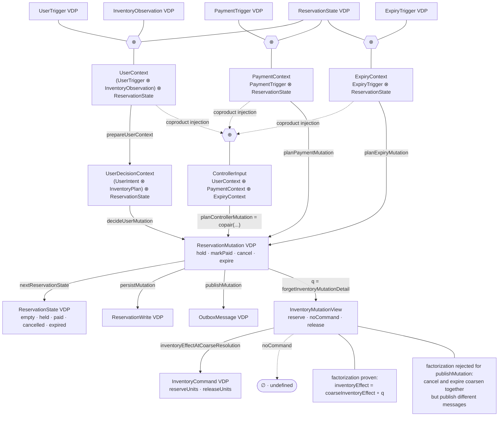

# ArchiScript

**Machine-checked architecture for AI-assisted software design.**

ArchiScript is a small Lean calculus for making architectural contracts precise
before implementation. An architect or AI proposes the semantic model; Lean
checks the stated mathematical obligations; engineers review whether the model
matches the real system.

Current release: **0.4.0**.

ArchiScript deliberately does **not** standardize a vocabulary of queues,
timeouts, failures, services, retries, or cloud resources. Those are meanings
chosen by the model author. ArchiScript standardizes how such meanings are
partitioned, connected, composed, combined, and safely viewed at different
resolutions.

## The core model

A model starts from a value universe and derives finite semantic distinctions
from it.

```text
carrier
  ↓ semantic predicates
Domain
  ↓ select a finite exhaustive disjoint family
VDP / Partition
  ↓ partial member maps
Operation
```

The basic vocabulary is:

| Concept | Meaning |
| --- | --- |
| **Carrier** | the full value universe considered at a boundary |
| **Domain** | a semantic predicate over that carrier |
| **VDP / Partition** | finitely many nonempty, disjoint, exhaustive semantic members |
| **Operation** | a partial function between VDP member sets |
| **Composition** | ordinary sequential composition of partial maps |
| **Tensor** | lossless structural AND for independent coordinates |
| **Coproduct** | lossless structural OR for design-time closed alternatives |
| **Refinement / coarsening** | two semantic resolutions of the same carrier |
| **Factorization** | proof that a consumer is insensitive to distinctions a coarsening removes |

At member level, operations form partial maps between finite sets. Tensor and
coproduct retain their conventional mathematical roles. Refinement is semantic
containment between partitions of the same carrier.

Lean checks the declared model. It does not discover missing requirements,
validate an external protocol, or prove that production code implements the
model.

## The most important rule: start from the carrier

Coverage is only meaningful relative to the carrier that was declared.

If malformed input, existing state, environment, configuration, or another
outcome-relevant fact can reach the boundary, removing it from the carrier does
not simplify the model — it makes the proof prove less.

For example, do this:

```text
WebhookPayload × LedgerObservation
```

when the outcome depends on both the incoming payload and existing ledger state.

Do not encode only the convenient semantic leaves into the carrier and then use
the resulting tautological coverage as evidence of completeness.

Member names are also not semantic definitions. Define the predicates first;
then prove that the VDP classifier corresponds to them.

## Composition

### Sequential composition

For:

```text
f : A ⇀ B
g : B ⇀ C
```

ArchiScript provides:

```text
g.comp f : A ⇀ C
```

Undefinedness propagates as ordinary partial-map composition.

### Tensor: independent coordinates

```text
P ⊗ Q
```

has carrier:

```text
Carrier(P) × Carrier(Q)
```

and contains every pair of selected members.

Tensor does not mean runtime concurrency. It says that the model has two
independently valued semantic coordinates.

Likewise:

```lean
f.tensor g
```

maps both coordinates componentwise and is defined only when both factor maps
are defined.

### Coproduct: design-time alternatives

```text
P ⊕ Q
```

has carrier:

```text
Carrier(P) + Carrier(Q)
```

and preserves both the summand tag and the original member identity.

ArchiScript uses coproduct only when the alternatives are already closed by the
architecture at design time. A program with exactly a browser entry point and a
CLI entry point may model:

```text
BrowserInput ⊕ CliInput
```

because the two channels exist independently of any runtime value.

Coproduct must **not** be used to enumerate cases discovered by inspecting
runtime data. A CLI parser, protocol decoder, or external message boundary still
needs a complete carrier and a complete VDP for all values that may arrive.

The invariant is:

```text
P ⊕ Q is exhaustive over Carrier(P) + Carrier(Q).

It does not prove that this sum exhausts an independently supplied
external boundary.
```

The public API provides canonical injections and `Operation.copair`; the
mediating operation is unique.

### Refinement and coarsening

Two VDPs can classify the same carrier at different resolutions.

```text
P ≼ Q
```

means that every fine member of `P` lies wholly inside one member of `Q`.
That containment induces a unique total coarsening member map:

```text
q : P → Q
```

and therefore an ordinary ArchiScript `Operation`.

A total surjective member map alone is not enough. The whole fine semantic region
must be contained in its selected coarse region.

### Consumer factorization

Given a coarsening:

```text
q : P → Q
```

and a consumer:

```text
f : P ⇀ Y
```

ArchiScript can ask whether there is a unique:

```text
g : Q ⇀ Y
```

with:

```text
f = g ∘ q
```

Equivalently, `f` must be constant on every fiber of `q`.

This is the mathematical basis for **semantic zoom** in diagrams. If
factorization succeeds, the consumer can be shown against the coarse VDP without
losing behavior. If it fails, ArchiScript can expose concrete fine members that
were incorrectly merged for that consumer.

## Small example: checkout

The checked
[Checkout model](ArchiScriptExamples/Checkout.lean) starts from two independent
runtime carriers:

```text
PaymentRequest
InventoryObservation
```

Each receives its own complete VDP and local operation:

```text
PaymentInput ──planPayment────▶ PaymentPlan
Inventory    ──planInventory──▶ InventoryPlan
```

The independent maps tensor:

```text
PaymentInput ⊗ Inventory
        │
        │ planPayment ⊗ planInventory
        ▼
PaymentPlan ⊗ InventoryPlan
        │
        │ chooseCheckoutAction
        ▼
CheckoutAction
```

The final fulfillment consumer does not need every `CheckoutAction`
distinction. The example therefore also defines a coarser view of the same
carrier:

```text
CheckoutAction
  ├── rejectPayment
  ├── rejectInventoryRequest
  ├── waitForStock
  └── placeOrder
          │
          │ coarsen
          ▼
FulfillmentView
  ├── noCommand
  └── submit
```

and proves:

```text
requestFulfillment
  =
requestFulfillmentAtCoarseResolution ∘ forgetCheckoutActionDetail
```

So the coarse view is not a presentation guess; it is justified by
factorization.

## Full-calculus stress test

The checked
[ReservationController](ArchiScriptExamples/ReservationController.lean) is the
canonical stress test. It intentionally combines the major algebraic features
in one model instead of demonstrating them in isolation.

The system has three design-time entry channels:

- user request + inventory observation + reservation state;
- payment event + reservation state;
- expiry trigger + reservation state.

Within a channel, independently valued coordinates are combined with tensor.
Across the three already-established channels, the controller uses coproduct.
The resulting paths converge on one detailed mutation VDP. Different consumers
then require different semantic resolutions of that same mutation carrier.


```mermaid
flowchart TB
  UT["UserTrigger VDP"]
  IO["InventoryObservation VDP"]
  RS["ReservationState VDP"]
  PT["PaymentTrigger VDP"]
  ET["ExpiryTrigger VDP"]

  UXT{{"⊗"}}
  PXT{{"⊗"}}
  EXT{{"⊗"}}

  UC["UserContext<br/>(UserTrigger ⊗ InventoryObservation) ⊗ ReservationState"]
  PC["PaymentContext<br/>PaymentTrigger ⊗ ReservationState"]
  EC["ExpiryContext<br/>ExpiryTrigger ⊗ ReservationState"]

  UDC["UserDecisionContext<br/>(UserIntent ⊗ InventoryPlan) ⊗ ReservationState"]

  COP{{"⊕"}}
  CI["ControllerInput<br/>UserContext ⊕ PaymentContext ⊕ ExpiryContext"]

  RM["ReservationMutation VDP<br/>hold · markPaid · cancel · expire"]
  RSTATE["ReservationState VDP<br/>empty · held · paid · cancelled · expired"]
  WRITE["ReservationWrite VDP"]
  OUTBOX["OutboxMessage VDP"]

  Q["InventoryMutationView<br/>reserve · noCommand · release"]
  INV["InventoryCommand VDP<br/>reserveUnits · releaseUnits"]
  NONE(["∅ · undefined"])

  NOTE1["factorization proven:<br/>inventoryEffect = coarseInventoryEffect ∘ q"]
  NOTE2["factorization rejected for publishMutation:<br/>cancel and expire coarsen together<br/>but publish different messages"]

  UT --- UXT
  IO --- UXT
  RS --- UXT
  UXT --- UC

  PT --- PXT
  RS --- PXT
  PXT --- PC

  ET --- EXT
  RS --- EXT
  EXT --- EC

  UC -->|"prepareUserContext"| UDC
  UDC -->|"decideUserMutation"| RM

  UC -.->|"coproduct injection"| COP
  PC -.->|"coproduct injection"| COP
  EC -.->|"coproduct injection"| COP
  COP --- CI
  CI -->|"planControllerMutation = copair(...)"| RM

  PC -->|"planPaymentMutation"| RM
  EC -->|"planExpiryMutation"| RM

  RM -->|"nextReservationState"| RSTATE
  RM -->|"persistMutation"| WRITE
  RM -->|"publishMutation"| OUTBOX

  RM -->|"q = forgetInventoryMutationDetail"| Q
  Q -->|"inventoryEffectAtCoarseResolution"| INV
  Q -.->|"noCommand"| NONE

  Q --- NOTE1
  Q --- NOTE2
```

The diagram contains several different kinds of structure; they should not be
confused:

- the `⊗` nodes are **VDP construction** for independent coordinates;
- the `⊕` node is **lossless design-time alternative aggregation**;
- solid labeled arrows are ordinary partial `Operation` mappings or
  compositions of them;
- `q` is an ordinary total operation induced by a proved coarsening;
- the first note records a successful factorization theorem;
- the second note records a failed factorization: the inventory view may merge
  `cancel` and `expire`, but the outbox consumer may not;
- `∅` is undefinedness, not a VDP member.

The same model also exposes a concurrency review boundary:

```text
authorized × held ──▶ markPaid
fired      × held ──▶ expire
```

Those independently sourced paths can request incompatible updates from the
same observed state. ArchiScript exposes the topology, but does not claim that a
runtime race occurs. Ordering, atomicity, liveness, resource effects, and
production conformance require additional semantics or evidence.

## Diagram discipline

ArchiScript diagrams are projections of the checked model, not an independent
source of truth.

A useful diagram may collapse detail only when the collapse is justified:

- tensor factors may stay visually factored rather than expanding a large
  Cartesian product;
- coproduct summands may be shown under one structural alternative node because
  the tags remain present in the model;
- fine VDP members may be replaced by a coarse VDP for a selected consumer only
  when factorization proves that the consumer cannot observe the removed
  distinctions.

A display group with hidden members is only a presentation device. It does not
create a new VDP member.

## What ArchiScript checks

For the declared model, Lean can check things such as:

- VDP coverage, disjointness, and inhabitance;
- correspondence between semantic predicates and selected members;
- partial member mappings;
- sequential composition;
- tensor laws and symmetric monoidal coherence;
- coproduct injections, copairing, and uniqueness;
- semantic refinement/coarsening;
- totality and surjectivity of proved coarsening maps;
- positive consumer factorization;
- concrete conflicts that prevent a proposed semantic zoom;
- architecture review and implementation-handoff obligations encoded by the
  review layer.

## What ArchiScript does not claim

A successful proof does not establish that:

- the carrier matches reality if the boundary was specified incorrectly;
- an external producer obeys an assumed contract;
- production code conforms to the architecture;
- a member arrow represents a successful database, queue, HTTP, or filesystem
  effect;
- tensor means simultaneous execution;
- fan-in proves a race;
- a cycle proves deadlock;
- the model has temporal, scheduler, resource, or distributed-system semantics
  that were never declared.

ArchiScript keeps these unknowns visible rather than silently deriving them from
graph shape.

## Public calculus

| Area | Main API |
| --- | --- |
| Semantic regions | `Domain`, complement, relative complement, `DomainDerivation` |
| VDPs | `Partition`, `HasMembers`, `SemanticPartition` |
| Boundary evidence | `CarrierOrigin`, `CarrierClosure`, `ArchitecturalPartition` |
| Sequential calculus | `Operation.id`, `Operation.comp` |
| Independent aggregation | `Partition.tensor`, `SemanticPartition.tensor`, `Operation.tensor` |
| Alternative aggregation | `Partition.coproduct`, `SemanticPartition.coproduct`, injections, `Operation.copair` |
| Coherence | associator, unitors, symmetry, naturality, pentagon, triangle, hexagon |
| Semantic resolution | `Partition.RefinesVia`, `Partition.Refines`, `Partition.coarseningOperation` |
| Factorization | `ConstantOnFibers`, `FactorsThrough`, `firstFiberConflict`, `analyzeFactorization` |
| Handoff | `Operation.Declaration`, `Operation.Registry`, canonical branch addresses |
| Routing | `ParameterizedPartition` |
| Review | `ReviewFinding`, `ReviewRecord`, revision-bound implementation gate |

## Examples

- [Checkout](ArchiScriptExamples/Checkout.lean) — tensor, composition, coarsening, and factorization
- [ConcurrencyQuestions](ArchiScriptExamples/ConcurrencyQuestions.lean) — design-time coproduct fan-in, tensor, and retry-cycle review shapes
- [ReservationController](ArchiScriptExamples/ReservationController.lean) — full-calculus stress test
- [FormInput](ArchiScriptExamples/FormInput.lean) — direct refinement/coarsening example
- [Coproduct](ArchiScriptExamples/Coproduct.lean) — minimal Browser/CLI coproduct example
- [PaymentWebhook](ArchiScriptExamples/PaymentWebhook.lean) — semantic decisions with observed ledger state
- [PaymentWebhookNetwork](ArchiScriptExamples/PaymentWebhookNetwork.lean) — connected multi-VDP architecture
- [UserRegistration](ArchiScriptExamples/UserRegistration.lean) — canonical branches and routing
- [Asphalt](ArchiScriptExamples/Asphalt.lean) — adversarial carrier and assumption stress test
- [Monoidal](ArchiScriptExamples/Monoidal.lean) — compact tensor/coherence example

## Build

```sh
lake build
bash scripts/check-negative.sh
lake env lean skills/archiscript/examples/CurrentApi.lean
python -m unittest discover -s scripts -p "test_*.py"
node --test examples/payment-webhook.test.mjs
```

The required PR gate runs the same checks. See
[CONTRIBUTING.md](CONTRIBUTING.md).

## AI skill

The repository includes an
[ArchiScript skill](skills/archiscript/SKILL.md) for AI agents. It teaches the
agent to begin from a justified carrier, state semantics independently of
classification, use tensor and coproduct with their strict structural meanings,
prove resolution changes rather than drawing them heuristically, preserve
unknowns, and keep formal architecture separate from production-code claims.

The public API smoke test is
[skills/archiscript/examples/CurrentApi.lean](skills/archiscript/examples/CurrentApi.lean).

## Project status

ArchiScript deliberately builds on established mathematics rather than a
project-specific software ontology. The experiment is whether a small semantic
architecture calculus, machine-checked local obligations, and explicit human
review improve AI-assisted implementation by exposing omitted cases, unjustified
generalizations, and unsafe simplifications before code is written.

Release history belongs in [CHANGELOG.md](CHANGELOG.md).

## License

Apache License 2.0. See [LICENSE](LICENSE).
