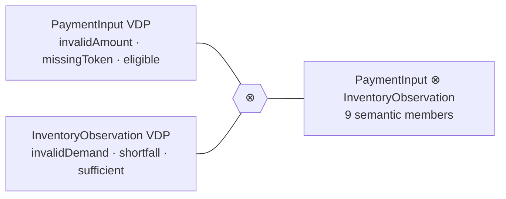
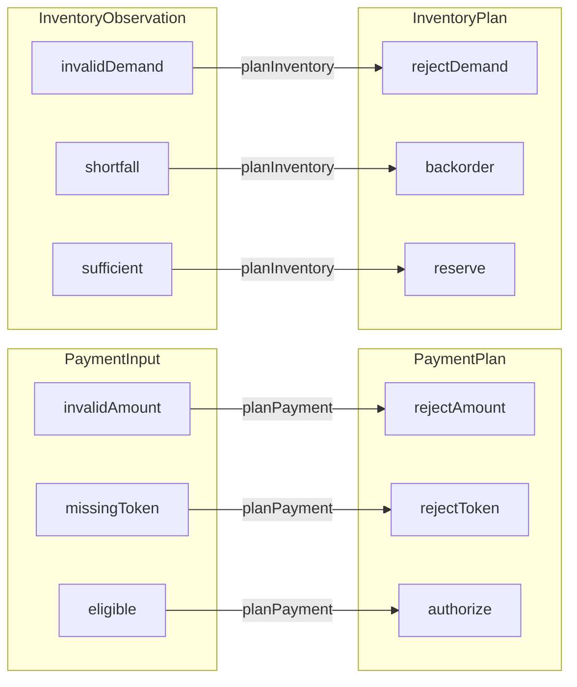
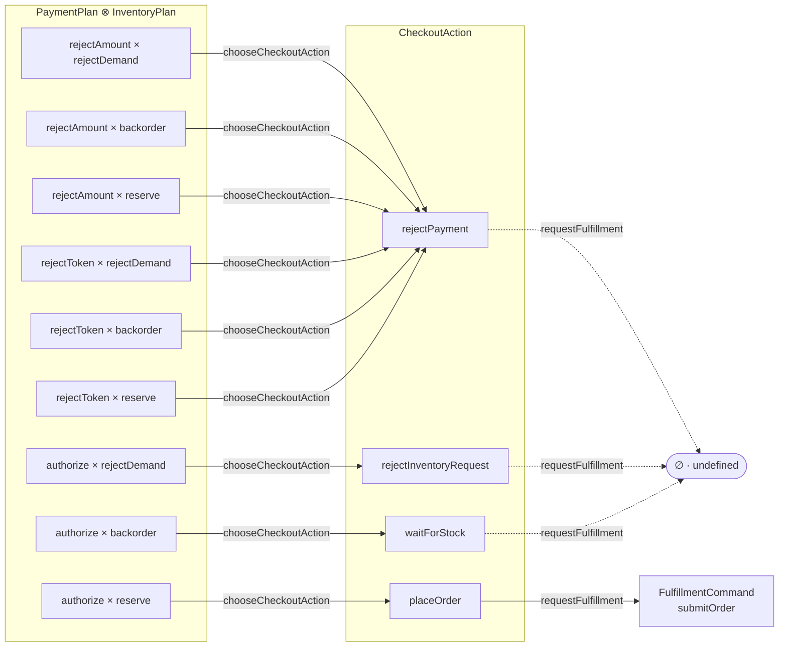
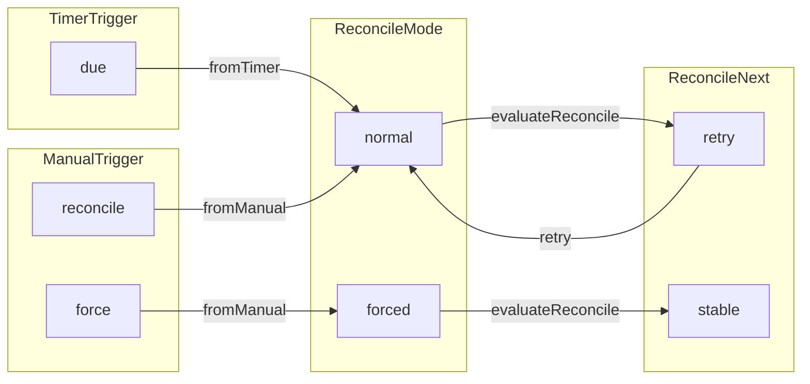
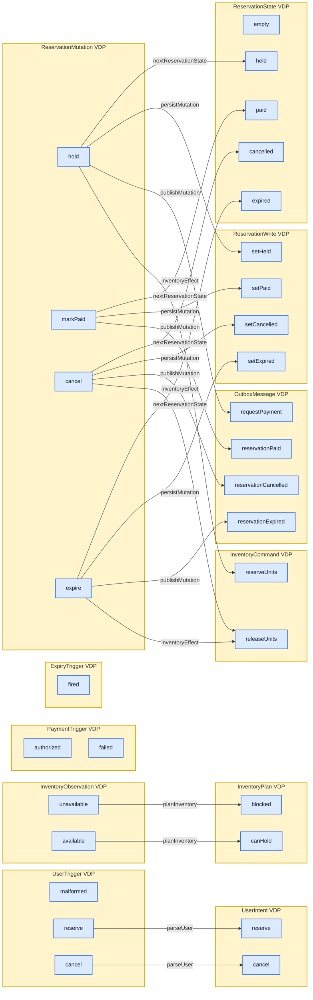

# ArchiScript

**Machine-checked architecture for AI-assisted software design.**

ArchiScript is a Lean library and an authoring discipline for making an
architecture precise before implementation. AI agents propose the model; Lean
checks the formal obligations of that model; engineers review whether it
actually describes the system.

Current release: **0.3.0**.

## The idea

ArchiScript models software architecture with a small calculus:

- a **carrier** is the full value universe considered at a boundary;
- a **Domain** is a semantic predicate over that carrier;
- a **VDP** is a finite partition into nonempty, disjoint, exhaustive semantic
  members;
- an **Operation** is a partial map between VDP member sets;
- `comp` is sequential composition;
- `tensor` combines independent VDPs and independent member maps;
- provenance, responsibility, bindings, evidence, findings, and approval live
  in the review/handoff layer.

Lean is not an architecture search engine and not a general model checker. It is
the executable implementation of **necessary correctness criteria for the
declared model**. A green proof means the stated obligations hold for the
carrier, predicates, mappings, and assumptions that were supplied. It does not
prove that the author chose the right requirements or that production code
conforms.

## Example: checkout

The checked
[checkout example](ArchiScriptExamples/Checkout.lean) is intentionally more than
an enum-to-enum toy. Its two input carriers exist independently of the semantic
cases we later select:

```text
PaymentRequest        = { amountCents : Nat, paymentToken : String }
InventoryObservation  = { requestedUnits : Nat, availableUnits : Nat }
```

They induce two separate VDPs:


```mermaid
flowchart LR
  P["PaymentInput VDP<br/>invalidAmount · missingToken · eligible"]
  I["InventoryObservation VDP<br/>invalidDemand · shortfall · sufficient"]
  T{{"⊗"}}
  J["PaymentInput ⊗ InventoryObservation<br/>9 semantic members"]

  P --- T
  I --- T
  T --- J
```

The undirected lines above mean **VDP construction**, not execution. Tensor keeps
the full product: no pair disappears because it looks inconvenient.

The individual members are then related by ordinary operations:


```mermaid
flowchart LR
  subgraph PIN["PaymentInput"]
    P0["invalidAmount"]
    P1["missingToken"]
    P2["eligible"]
  end

  subgraph POUT["PaymentPlan"]
    Q0["rejectAmount"]
    Q1["rejectToken"]
    Q2["authorize"]
  end

  subgraph IIN["InventoryObservation"]
    I0["invalidDemand"]
    I1["shortfall"]
    I2["sufficient"]
  end

  subgraph IOUT["InventoryPlan"]
    J0["rejectDemand"]
    J1["backorder"]
    J2["reserve"]
  end

  P0 -->|"planPayment"| Q0
  P1 -->|"planPayment"| Q1
  P2 -->|"planPayment"| Q2

  I0 -->|"planInventory"| J0
  I1 -->|"planInventory"| J1
  I2 -->|"planInventory"| J2
```

Those two member maps tensor into one operation between the product VDPs:

```lean
def planCheckoutFactors :
    Operation
      (paymentInputPartition.tensor inventoryObservationPartition)
      (paymentPlanPartition.tensor inventoryPlanPartition) :=
  planPayment.tensor planInventory
```

The next operation is deliberately **not** factorized. It makes a joint checkout
decision from the nine product members:


```mermaid
flowchart LR
  subgraph PLAN["PaymentPlan ⊗ InventoryPlan"]
    A0["rejectAmount × rejectDemand"]
    A1["rejectAmount × backorder"]
    A2["rejectAmount × reserve"]
    B0["rejectToken × rejectDemand"]
    B1["rejectToken × backorder"]
    B2["rejectToken × reserve"]
    C0["authorize × rejectDemand"]
    C1["authorize × backorder"]
    C2["authorize × reserve"]
  end

  subgraph ACTION["CheckoutAction"]
    R["rejectPayment"]
    V["rejectInventoryRequest"]
    W["waitForStock"]
    O["placeOrder"]
  end

  F["FulfillmentCommand<br/>submitOrder"]
  N(["∅ · undefined"])

  A0 -->|"chooseCheckoutAction"| R
  A1 -->|"chooseCheckoutAction"| R
  A2 -->|"chooseCheckoutAction"| R
  B0 -->|"chooseCheckoutAction"| R
  B1 -->|"chooseCheckoutAction"| R
  B2 -->|"chooseCheckoutAction"| R
  C0 -->|"chooseCheckoutAction"| V
  C1 -->|"chooseCheckoutAction"| W
  C2 -->|"chooseCheckoutAction"| O

  R -.->|"requestFulfillment"| N
  V -.->|"requestFulfillment"| N
  W -.->|"requestFulfillment"| N
  O -->|"requestFulfillment"| F
```

This one picture shows the three core ArchiScript ideas:

- **VDP members carry semantic distinctions**;
- **Operation arrows map those members explicitly**;
- **tensor preserves independent combinations**, while later operations may
  intentionally coarsen them.

The complete path is ordinary sequential composition after the tensor operation:

```lean
def decideCheckout :
    Operation
      (paymentInputPartition.tensor inventoryObservationPartition)
      checkoutActionPartition :=
  chooseCheckoutAction.comp planCheckoutFactors
```

`requestFulfillment` is partial: only `placeOrder` maps to
`submitOrder`. The undefined members say nothing by themselves about runtime
database, network, or queue effects.

## Concurrency review shapes

ArchiScript 0.3.0 does not prove races, but its topology can expose places that
deserve a concurrency review. The checked
[ConcurrencyQuestions example](ArchiScriptExamples/ConcurrencyQuestions.lean)
contains both independent fan-in and a retry cycle:


```mermaid
flowchart LR
  subgraph M["ManualTrigger"]
    M0["reconcile"]
    M1["force"]
  end

  subgraph T["TimerTrigger"]
    T0["due"]
  end

  subgraph R["ReconcileMode"]
    R0["normal"]
    R1["forced"]
  end

  subgraph N["ReconcileNext"]
    N0["retry"]
    N1["stable"]
  end

  M0 -->|"fromManual"| R0
  M1 -->|"fromManual"| R1
  T0 -->|"fromTimer"| R0

  R0 -->|"evaluateReconcile"| N0
  R1 -->|"evaluateReconcile"| N1
  N0 -->|"retry"| R0
```

The two incoming arrows to `ReconcileMode` come from **different source VDPs**,
so they represent independently available architectural triggers. That is a
useful review boundary if both paths later affect the same mutable resource.

The cycle

```text
ReconcileMode -> ReconcileNext -> ReconcileMode
```

is not a concurrency bug by itself; it is a sequential retry loop. The stronger
question appears when an independently sourced arrow can enter the same loop
while resource-changing work is in progress. At that point reviewers should ask
about ordering, atomicity, idempotency, or commutativity. Those runtime claims
remain `UNKNOWN` until resource/effect semantics or external evidence justify
them.

## Stateful stress example

The checked
[ReservationController example](ArchiScriptExamples/ReservationController.lean)
puts most of the calculus in one small system: several independently available
triggers, tensor products, partial operations, a shared logical state, and
multiple downstream effect contracts.

The diagrams use one visual grammar throughout:

- **yellow container = one VDP**;
- **blue node = one member of that VDP**;
- **undirected connection / ⊗ = tensor construction**;
- **directed arrow = an `Operation` member mapping**.

### 1. Elementary VDPs first

Before any tensor appears, every elementary VDP is explicit and every blue node
is an actual member.


```mermaid
flowchart LR
  classDef member fill:#dbeafe,stroke:#2563eb,color:#0f172a,stroke-width:1.5px

  subgraph UT["UserTrigger VDP"]
    UT0["malformed"]:::member
    UT1["reserve"]:::member
    UT2["cancel"]:::member
  end

  subgraph UI["UserIntent VDP"]
    UI0["reserve"]:::member
    UI1["cancel"]:::member
  end

  subgraph IO["InventoryObservation VDP"]
    IO0["unavailable"]:::member
    IO1["available"]:::member
  end

  subgraph IP["InventoryPlan VDP"]
    IP0["blocked"]:::member
    IP1["canHold"]:::member
  end

  subgraph PT["PaymentTrigger VDP"]
    PT0["authorized"]:::member
    PT1["failed"]:::member
  end

  subgraph ET["ExpiryTrigger VDP"]
    ET0["fired"]:::member
  end

  subgraph RS["ReservationState VDP"]
    RS0["empty"]:::member
    RS1["held"]:::member
    RS2["paid"]:::member
    RS3["cancelled"]:::member
    RS4["expired"]:::member
  end

  subgraph RM["ReservationMutation VDP"]
    RM0["hold"]:::member
    RM1["markPaid"]:::member
    RM2["cancel"]:::member
    RM3["expire"]:::member
  end

  subgraph RW["ReservationWrite VDP"]
    RW0["setHeld"]:::member
    RW1["setPaid"]:::member
    RW2["setCancelled"]:::member
    RW3["setExpired"]:::member
  end

  subgraph OM["OutboxMessage VDP"]
    OM0["requestPayment"]:::member
    OM1["reservationPaid"]:::member
    OM2["reservationCancelled"]:::member
    OM3["reservationExpired"]:::member
  end

  subgraph IC["InventoryCommand VDP"]
    IC0["reserveUnits"]:::member
    IC1["releaseUnits"]:::member
  end

  UT1 -->|"parseUser"| UI0
  UT2 -->|"parseUser"| UI1

  IO0 -->|"planInventory"| IP0
  IO1 -->|"planInventory"| IP1

  RM0 -->|"nextReservationState"| RS1
  RM1 -->|"nextReservationState"| RS2
  RM2 -->|"nextReservationState"| RS3
  RM3 -->|"nextReservationState"| RS4

  RM0 -->|"persistMutation"| RW0
  RM1 -->|"persistMutation"| RW1
  RM2 -->|"persistMutation"| RW2
  RM3 -->|"persistMutation"| RW3

  RM0 -->|"publishMutation"| OM0
  RM1 -->|"publishMutation"| OM1
  RM2 -->|"publishMutation"| OM2
  RM3 -->|"publishMutation"| OM3

  RM0 -->|"inventoryEffect"| IC0
  RM2 -->|"inventoryEffect"| IC1
  RM3 -->|"inventoryEffect"| IC1

  style UT fill:#fff4cc,stroke:#d6a700,stroke-width:2px
  style UI fill:#fff4cc,stroke:#d6a700,stroke-width:2px
  style IO fill:#fff4cc,stroke:#d6a700,stroke-width:2px
  style IP fill:#fff4cc,stroke:#d6a700,stroke-width:2px
  style PT fill:#fff4cc,stroke:#d6a700,stroke-width:2px
  style ET fill:#fff4cc,stroke:#d6a700,stroke-width:2px
  style RS fill:#fff4cc,stroke:#d6a700,stroke-width:2px
  style RM fill:#fff4cc,stroke:#d6a700,stroke-width:2px
  style RW fill:#fff4cc,stroke:#d6a700,stroke-width:2px
  style OM fill:#fff4cc,stroke:#d6a700,stroke-width:2px
  style IC fill:#fff4cc,stroke:#d6a700,stroke-width:2px
```

The missing `malformed -> UserIntent` arrow and
`markPaid -> InventoryCommand` arrow are deliberate: those operations are
partial. Side effects are not special syntax; persistence, publication, and
inventory work are just more member maps.

### 2. Then tensor the elementary VDPs

The user path forms

```text
(UserTrigger ⊗ InventoryObservation) ⊗ ReservationState
    3 × 2 × 5 = 30 members

(UserIntent ⊗ InventoryPlan) ⊗ ReservationState
    2 × 2 × 5 = 20 members
```

and `prepareUserContext = (parseUser ⊗ planInventory) ⊗ id`.
Every product member is shown below. The twenty directed
`prepareUserContext` arrows are exactly the componentwise tensor mapping;
the ten `malformed × ...` members have no arrow because `parseUser malformed =
none`.


```mermaid
flowchart TB
  classDef member fill:#dbeafe,stroke:#2563eb,color:#0f172a,stroke-width:1.5px

  subgraph UC0["Tensor VDP · (UserTrigger ⊗ InventoryObservation) ⊗ ReservationState · 30 members"]
    direction TB
    subgraph UC0_SL_malformed["slice: malformed × InventoryObservation × ReservationState"]
      direction LR
      UC0_malformed_unavailable_empty["malformed × unavailable × empty"]:::member
      UC0_malformed_unavailable_held["malformed × unavailable × held"]:::member
      UC0_malformed_unavailable_paid["malformed × unavailable × paid"]:::member
      UC0_malformed_unavailable_cancelled["malformed × unavailable × cancelled"]:::member
      UC0_malformed_unavailable_expired["malformed × unavailable × expired"]:::member
      UC0_malformed_available_empty["malformed × available × empty"]:::member
      UC0_malformed_available_held["malformed × available × held"]:::member
      UC0_malformed_available_paid["malformed × available × paid"]:::member
      UC0_malformed_available_cancelled["malformed × available × cancelled"]:::member
      UC0_malformed_available_expired["malformed × available × expired"]:::member
    end
    subgraph UC0_SL_reserve["slice: reserve × InventoryObservation × ReservationState"]
      direction LR
      UC0_reserve_unavailable_empty["reserve × unavailable × empty"]:::member
      UC0_reserve_unavailable_held["reserve × unavailable × held"]:::member
      UC0_reserve_unavailable_paid["reserve × unavailable × paid"]:::member
      UC0_reserve_unavailable_cancelled["reserve × unavailable × cancelled"]:::member
      UC0_reserve_unavailable_expired["reserve × unavailable × expired"]:::member
      UC0_reserve_available_empty["reserve × available × empty"]:::member
      UC0_reserve_available_held["reserve × available × held"]:::member
      UC0_reserve_available_paid["reserve × available × paid"]:::member
      UC0_reserve_available_cancelled["reserve × available × cancelled"]:::member
      UC0_reserve_available_expired["reserve × available × expired"]:::member
    end
    subgraph UC0_SL_cancel["slice: cancel × InventoryObservation × ReservationState"]
      direction LR
      UC0_cancel_unavailable_empty["cancel × unavailable × empty"]:::member
      UC0_cancel_unavailable_held["cancel × unavailable × held"]:::member
      UC0_cancel_unavailable_paid["cancel × unavailable × paid"]:::member
      UC0_cancel_unavailable_cancelled["cancel × unavailable × cancelled"]:::member
      UC0_cancel_unavailable_expired["cancel × unavailable × expired"]:::member
      UC0_cancel_available_empty["cancel × available × empty"]:::member
      UC0_cancel_available_held["cancel × available × held"]:::member
      UC0_cancel_available_paid["cancel × available × paid"]:::member
      UC0_cancel_available_cancelled["cancel × available × cancelled"]:::member
      UC0_cancel_available_expired["cancel × available × expired"]:::member
    end
  end

  subgraph UC1["Tensor VDP · (UserIntent ⊗ InventoryPlan) ⊗ ReservationState · 20 members"]
    direction TB
    subgraph UC1_SL_reserve["slice: reserve × InventoryPlan × ReservationState"]
      direction LR
      UC1_reserve_blocked_empty["reserve × blocked × empty"]:::member
      UC1_reserve_blocked_held["reserve × blocked × held"]:::member
      UC1_reserve_blocked_paid["reserve × blocked × paid"]:::member
      UC1_reserve_blocked_cancelled["reserve × blocked × cancelled"]:::member
      UC1_reserve_blocked_expired["reserve × blocked × expired"]:::member
      UC1_reserve_canHold_empty["reserve × canHold × empty"]:::member
      UC1_reserve_canHold_held["reserve × canHold × held"]:::member
      UC1_reserve_canHold_paid["reserve × canHold × paid"]:::member
      UC1_reserve_canHold_cancelled["reserve × canHold × cancelled"]:::member
      UC1_reserve_canHold_expired["reserve × canHold × expired"]:::member
    end
    subgraph UC1_SL_cancel["slice: cancel × InventoryPlan × ReservationState"]
      direction LR
      UC1_cancel_blocked_empty["cancel × blocked × empty"]:::member
      UC1_cancel_blocked_held["cancel × blocked × held"]:::member
      UC1_cancel_blocked_paid["cancel × blocked × paid"]:::member
      UC1_cancel_blocked_cancelled["cancel × blocked × cancelled"]:::member
      UC1_cancel_blocked_expired["cancel × blocked × expired"]:::member
      UC1_cancel_canHold_empty["cancel × canHold × empty"]:::member
      UC1_cancel_canHold_held["cancel × canHold × held"]:::member
      UC1_cancel_canHold_paid["cancel × canHold × paid"]:::member
      UC1_cancel_canHold_cancelled["cancel × canHold × cancelled"]:::member
      UC1_cancel_canHold_expired["cancel × canHold × expired"]:::member
    end
  end

  subgraph MUT["ReservationMutation VDP"]
    MU0["hold"]:::member
    MU1["markPaid"]:::member
    MU2["cancel"]:::member
    MU3["expire"]:::member
  end

  UC0_reserve_unavailable_empty -->|"prepareUserContext"| UC1_reserve_blocked_empty
  UC0_reserve_unavailable_held -->|"prepareUserContext"| UC1_reserve_blocked_held
  UC0_reserve_unavailable_paid -->|"prepareUserContext"| UC1_reserve_blocked_paid
  UC0_reserve_unavailable_cancelled -->|"prepareUserContext"| UC1_reserve_blocked_cancelled
  UC0_reserve_unavailable_expired -->|"prepareUserContext"| UC1_reserve_blocked_expired
  UC0_reserve_available_empty -->|"prepareUserContext"| UC1_reserve_canHold_empty
  UC0_reserve_available_held -->|"prepareUserContext"| UC1_reserve_canHold_held
  UC0_reserve_available_paid -->|"prepareUserContext"| UC1_reserve_canHold_paid
  UC0_reserve_available_cancelled -->|"prepareUserContext"| UC1_reserve_canHold_cancelled
  UC0_reserve_available_expired -->|"prepareUserContext"| UC1_reserve_canHold_expired
  UC0_cancel_unavailable_empty -->|"prepareUserContext"| UC1_cancel_blocked_empty
  UC0_cancel_unavailable_held -->|"prepareUserContext"| UC1_cancel_blocked_held
  UC0_cancel_unavailable_paid -->|"prepareUserContext"| UC1_cancel_blocked_paid
  UC0_cancel_unavailable_cancelled -->|"prepareUserContext"| UC1_cancel_blocked_cancelled
  UC0_cancel_unavailable_expired -->|"prepareUserContext"| UC1_cancel_blocked_expired
  UC0_cancel_available_empty -->|"prepareUserContext"| UC1_cancel_canHold_empty
  UC0_cancel_available_held -->|"prepareUserContext"| UC1_cancel_canHold_held
  UC0_cancel_available_paid -->|"prepareUserContext"| UC1_cancel_canHold_paid
  UC0_cancel_available_cancelled -->|"prepareUserContext"| UC1_cancel_canHold_cancelled
  UC0_cancel_available_expired -->|"prepareUserContext"| UC1_cancel_canHold_expired

  UC1_reserve_canHold_empty -->|"decideUserMutation"| MU0
  UC1_cancel_blocked_held -->|"decideUserMutation"| MU2
  UC1_cancel_canHold_held -->|"decideUserMutation"| MU2

  style UC0 fill:#fff4cc,stroke:#d6a700,stroke-width:2px
  style UC1 fill:#fff4cc,stroke:#d6a700,stroke-width:2px
  style MUT fill:#fff4cc,stroke:#d6a700,stroke-width:2px
  style UC0_SL_malformed fill:transparent,stroke:#d1d5db,stroke-dasharray:3 3
  style UC0_SL_reserve fill:transparent,stroke:#d1d5db,stroke-dasharray:3 3
  style UC0_SL_cancel fill:transparent,stroke:#d1d5db,stroke-dasharray:3 3
  style UC1_SL_reserve fill:transparent,stroke:#d1d5db,stroke-dasharray:3 3
  style UC1_SL_cancel fill:transparent,stroke:#d1d5db,stroke-dasharray:3 3
```

This is the important separation: the elementary VDPs exist first; tensor does
not invent their meanings. It only forms the full product of their already
defined members.

### 3. Independent triggers tensor with the same state VDP

Payment and expiry are separate source VDPs. Each forms its own tensor with the
same `ReservationState` VDP. Again, every blue node below is a real product
member.


```mermaid
flowchart TB
  classDef member fill:#dbeafe,stroke:#2563eb,color:#0f172a,stroke-width:1.5px

  subgraph PC["Tensor VDP · PaymentTrigger ⊗ ReservationState · 10 members"]
    direction TB
    subgraph PC_SL_authorized["slice: authorized × ReservationState"]
      direction LR
      PC_authorized_empty["authorized × empty"]:::member
      PC_authorized_held["authorized × held"]:::member
      PC_authorized_paid["authorized × paid"]:::member
      PC_authorized_cancelled["authorized × cancelled"]:::member
      PC_authorized_expired["authorized × expired"]:::member
    end
    subgraph PC_SL_failed["slice: failed × ReservationState"]
      direction LR
      PC_failed_empty["failed × empty"]:::member
      PC_failed_held["failed × held"]:::member
      PC_failed_paid["failed × paid"]:::member
      PC_failed_cancelled["failed × cancelled"]:::member
      PC_failed_expired["failed × expired"]:::member
    end
  end

  subgraph EC["Tensor VDP · ExpiryTrigger ⊗ ReservationState · 5 members"]
    direction LR
    EC_fired_empty["fired × empty"]:::member
    EC_fired_held["fired × held"]:::member
    EC_fired_paid["fired × paid"]:::member
    EC_fired_cancelled["fired × cancelled"]:::member
    EC_fired_expired["fired × expired"]:::member
  end

  subgraph MUT["ReservationMutation VDP"]
    M0["hold"]:::member
    M1["markPaid"]:::member
    M2["cancel"]:::member
    M3["expire"]:::member
  end

  PC_authorized_held -->|"planPaymentMutation"| M1
  PC_failed_held -->|"planPaymentMutation"| M2
  EC_fired_held -->|"planExpiryMutation"| M3

  style PC fill:#fff4cc,stroke:#d6a700,stroke-width:2px
  style EC fill:#fff4cc,stroke:#d6a700,stroke-width:2px
  style MUT fill:#fff4cc,stroke:#d6a700,stroke-width:2px
  style PC_SL_authorized fill:transparent,stroke:#d1d5db,stroke-dasharray:3 3
  style PC_SL_failed fill:transparent,stroke:#d1d5db,stroke-dasharray:3 3
```

Now the concurrency review hotspot is visible at member level:

```text
authorized × held -> markPaid -> setPaid
fired      × held -> expire   -> setExpired
```

Two independently available triggers can therefore observe the same semantic
state member and request incompatible writes to the same logical reservation
record. ArchiScript exposes that topology; it still does not prove whether the
runtime serializes the writes, uses compare-and-swap, rejects stale
observations, or allows a race.

The semantic state transition is also kept distinct from the persistence
contract:

```lean
nextReservationState : ReservationMutation -> ReservationState
persistMutation      : ReservationMutation -> ReservationWrite
publishMutation      : ReservationMutation -> OutboxMessage
inventoryEffect      : ReservationMutation -> InventoryCommand
```

There is deliberately no `ReservationWrite -> ReservationState` arrow. A write
request does not prove that the runtime effect occurred or that a later state
observation changed.

Finally, ordinary fan-out is not tensor. One `ReservationMutation` may have
several outgoing operations. Writing
`persistMutation.tensor publishMutation` would instead require two independent
mutation slots and would describe a different architecture.

## 0.3.0 monoidal API

For VDPs `P` and `Q`, `Partition.tensor P Q` has carrier
`P.Carrier × Q.Carrier` and every pair of members. Even `P.tensor P` has two
independent carrier slots.

The public API includes:

```lean
#check Partition.tensor
#check Partition.unit
#check SemanticPartition.tensor

#check Operation.tensor
#check Operation.tensor_id
#check Operation.tensor_comp

#check Partition.tensorAssociator
#check Partition.tensorLeftUnitor
#check Partition.tensorRightUnitor
#check Partition.tensorSymmetry

#check Operation.associator_natural
#check Operation.leftUnitor_natural
#check Operation.rightUnitor_natural
#check Operation.symmetry_natural
#check Operation.pentagon
#check Operation.triangle
#check Operation.hexagon
```

Tensor is mathematically permissive. If `Account(A) ⊗ Payment(B)` is a strange
architectural combination, that is a **review question**, not a reason to mutate
or partially define tensor.

Tensor also does not mean runtime parallelism. Two branches of one operation are
ordinary alternatives of one partial map; they are not concurrent arrows.

## Core tooling

| Area | API |
| --- | --- |
| Semantic regions | `Domain`, complement, relative complement, `DomainDerivation` |
| VDPs | `Partition`, `HasMembers`, `SemanticPartition` |
| Boundary evidence | `CarrierOrigin`, `CarrierClosure`, `ArchitecturalPartition` |
| Sequential calculus | `Operation.id`, `Operation.comp` |
| Independent calculus | `Partition.tensor`, `SemanticPartition.tensor`, `Operation.tensor` |
| Coherence | associator, unitors, symmetry, naturality, pentagon, triangle, hexagon |
| Handoff | `Operation.Declaration`, `Operation.Registry`, canonical branch addresses |
| Routing | `ParameterizedPartition` |
| Review | `ReviewFinding`, `ReviewRecord`, revision-bound implementation gate |

## Modeling rules

Three rules prevent most bad models.

**Start from the carrier, not from desired outcomes.** Coverage proves coverage
of the carrier you declared. If malformed input, stale state, or relevant
environment context was omitted from the carrier, Lean cannot recover it.

**State semantic meaning independently of the classifier.** Member names are not
definitions. Define predicates first, then prove `Partition.HasMembers`.

**Keep member maps separate from effects.** `Operation X Y` is a partial map
between semantic members. It is not a database transaction, network request,
scheduler, or handler execution.

## Review and implementation handoff

ArchiScript keeps proof and engineering approval separate.

`ArchitecturalPartition` records carrier provenance and selected semantic
members. `Operation.Registry` gives stable operation and branch identities,
responsibility, implementation dispositions, source references, and evidence.
`ReviewRecord.implementationAllowed` becomes true only for an approved matching
revision with no open findings.

A compiling model is therefore not automatically an approved architecture.

## What ArchiScript does not claim

ArchiScript 0.3.0 does not:

- discover requirements omitted from the carrier;
- prove that an external system enforces a declared boundary guarantee;
- prove general production-code conformance;
- infer runtime effects from member arrows;
- model scheduler interleavings or liveness;
- automatically prove races, deadlocks, atomicity, or idempotency;
- treat tensor as common refinement or same-value synchronization;
- filter supposedly impossible tensor member pairs.

Use complementary formal tools when the problem requires temporal or distributed
behavior beyond this calculus.

## Examples

- [Checkout](ArchiScriptExamples/Checkout.lean) — multi-VDP tensor + sequential composition
- [PaymentWebhook](ArchiScriptExamples/PaymentWebhook.lean) — semantic decisions with observed ledger state
- [PaymentWebhookNetwork](ArchiScriptExamples/PaymentWebhookNetwork.lean) — connected multi-VDP architecture
- [FormInput](ArchiScriptExamples/FormInput.lean) — multiple resolutions of one carrier
- [UserRegistration](ArchiScriptExamples/UserRegistration.lean) — canonical branches and routing
- [Asphalt](ArchiScriptExamples/Asphalt.lean) — adversarial boundary/assumption stress test
- [Monoidal](ArchiScriptExamples/Monoidal.lean) — compact tensor/coherence example
- [ConcurrencyQuestions](ArchiScriptExamples/ConcurrencyQuestions.lean) — independent fan-in and retry-cycle review shapes
- [ReservationController](ArchiScriptExamples/ReservationController.lean) — tensor, shared state, independent triggers, partial effects, and same-resource update review

## Build

```sh
lake build
bash scripts/check-negative.sh
lake env lean skills/archiscript/examples/CurrentApi.lean
python -m unittest discover -s scripts -p "test_*.py"
node --test examples/payment-webhook.test.mjs
```

The required PR gate runs the same checks. See [CONTRIBUTING.md](CONTRIBUTING.md).

## AI skill

The repository includes an
[ArchiScript skill](skills/archiscript/SKILL.md) for AI agents. It teaches the
agent to audit carriers, define semantic predicates independently, use tensor
with full-product semantics, preserve assumptions and unknowns, resolve canonical
branch bindings, and keep architecture proof separate from code conformance.

The public API smoke test is
[skills/archiscript/examples/CurrentApi.lean](skills/archiscript/examples/CurrentApi.lean).

## Project status

ArchiScript deliberately builds on established mathematics. The experiment is
whether a small semantic architecture calculus, Lean-checked obligations, and
explicit human review improve AI-driven implementation by exposing omitted
cases and hidden assumptions before code is written.

See [CHANGELOG.md](CHANGELOG.md) for release history.

## License

Apache License 2.0. See [LICENSE](LICENSE).
