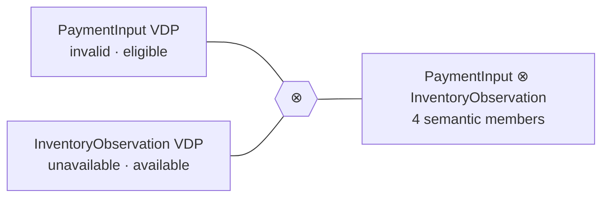
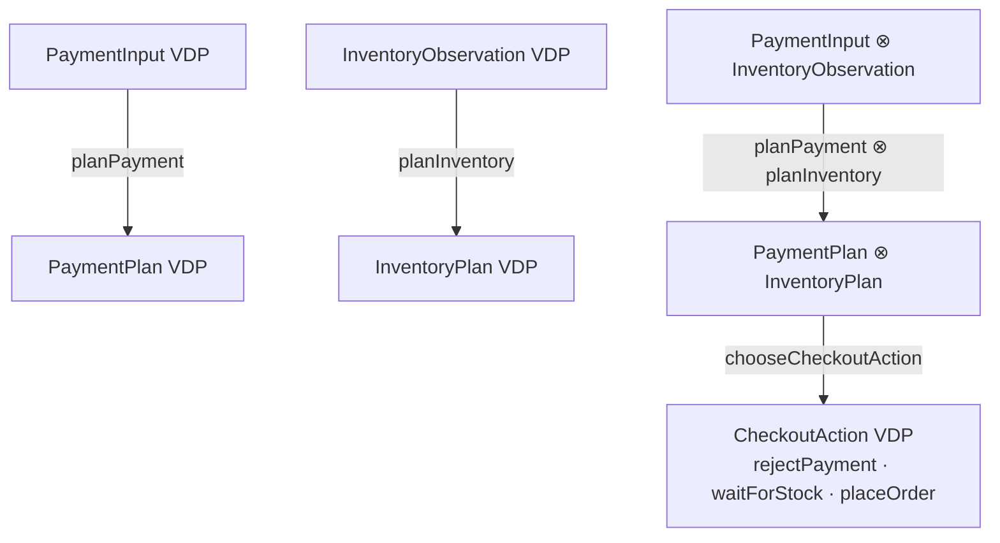

# ArchiScript

**Machine-checked architecture for AI-assisted software design.**

ArchiScript is a Lean library and an authoring discipline for making an
architecture precise before implementation. AI agents propose the model; Lean
checks the formal obligations of that model; engineers review whether it
actually describes the system.

Current release: **0.3.0**.

## The idea

ArchiScript models software architecture with a small calculus:

- a **carrier** is the full value universe considered at a boundary;
- a **Domain** is a semantic predicate over that carrier;
- a **VDP** is a finite partition into nonempty, disjoint, exhaustive semantic
  members;
- an **Operation** is a partial map between VDP member sets;
- `comp` is sequential composition;
- `tensor` combines independent VDPs and independent member maps;
- provenance, responsibility, bindings, evidence, findings, and approval live
  in the review/handoff layer.

Lean is not an architecture search engine and not a general model checker. It is
the executable implementation of **necessary correctness criteria for the
declared model**. A green proof means the stated obligations hold for the
carrier, predicates, mappings, and assumptions that were supplied. It does not
prove that the author chose the right requirements or that production code
conforms.

## Example: checkout

The checked
[checkout example](ArchiScriptExamples/Checkout.lean) uses several VDPs,
ordinary operations, tensor composition, and a final sequential decision.

We start with **two separate VDPs**:

- `PaymentInput`: `invalid | eligible`
- `InventoryObservation`: `unavailable | available`

Tensor constructs a new VDP from those two existing objects.


```mermaid
flowchart LR
  P["PaymentInput VDP<br/>invalid · eligible"]
  I["InventoryObservation VDP<br/>unavailable · available"]
  T{{"⊗"}}
  J["PaymentInput ⊗ InventoryObservation<br/>4 semantic members"]

  P --- T
  I --- T
  T --- J
```

Those lines show **object construction**, not runtime calls and not
`Operation` values. The result contains the full Cartesian member product:

```text
invalid  × unavailable
invalid  × available
eligible × unavailable
eligible × available
```

Each factor also has its own operation:

```text
planPayment   : PaymentInput         → PaymentPlan
planInventory : InventoryObservation → InventoryPlan
```

Their tensor is an operation between the product VDPs, and an ordinary
sequential operation consumes the joint result:


```mermaid
flowchart TB
  P["PaymentInput VDP"] -->|"planPayment"| PP["PaymentPlan VDP"]
  I["InventoryObservation VDP"] -->|"planInventory"| IP["InventoryPlan VDP"]

  JI["PaymentInput ⊗ InventoryObservation"]
  JP["PaymentPlan ⊗ InventoryPlan"]
  A["CheckoutAction VDP<br/>rejectPayment · waitForStock · placeOrder"]

  JI -->|"planPayment ⊗ planInventory"| JP
  JP -->|"chooseCheckoutAction"| A
```

So the architecture contains both forms of composition:

```text
planPayment ⊗ planInventory   independent composition
chooseCheckoutAction.comp …   sequential composition
```

The corresponding Lean is small:

```lean
def planCheckoutFactors :
    Operation
      (paymentInputPartition.tensor inventoryObservationPartition)
      (paymentPlanPartition.tensor inventoryPlanPartition) :=
  planPayment.tensor planInventory

def decideCheckout :
    Operation
      (paymentInputPartition.tensor inventoryObservationPartition)
      checkoutActionPartition :=
  chooseCheckoutAction.comp planCheckoutFactors
```

The downstream operation may map several joint members to the same action. That
coarsening is explicit in the operation; tensor itself never prunes combinations.

## 0.3.0 monoidal API

For VDPs `P` and `Q`, `Partition.tensor P Q` has carrier
`P.Carrier × Q.Carrier` and every pair of members. Even `P.tensor P` has two
independent carrier slots.

The public API includes:

```lean
#check Partition.tensor
#check Partition.unit
#check SemanticPartition.tensor

#check Operation.tensor
#check Operation.tensor_id
#check Operation.tensor_comp

#check Partition.tensorAssociator
#check Partition.tensorLeftUnitor
#check Partition.tensorRightUnitor
#check Partition.tensorSymmetry

#check Operation.associator_natural
#check Operation.leftUnitor_natural
#check Operation.rightUnitor_natural
#check Operation.symmetry_natural
#check Operation.pentagon
#check Operation.triangle
#check Operation.hexagon
```

Tensor is mathematically permissive. If `Account(A) ⊗ Payment(B)` is a strange
architectural combination, that is a **review question**, not a reason to mutate
or partially define tensor.

Tensor also does not mean runtime parallelism. Two branches of one operation are
ordinary alternatives of one partial map; they are not concurrent arrows.

## Core tooling

| Area | API |
| --- | --- |
| Semantic regions | `Domain`, complement, relative complement, `DomainDerivation` |
| VDPs | `Partition`, `HasMembers`, `SemanticPartition` |
| Boundary evidence | `CarrierOrigin`, `CarrierClosure`, `ArchitecturalPartition` |
| Sequential calculus | `Operation.id`, `Operation.comp` |
| Independent calculus | `Partition.tensor`, `SemanticPartition.tensor`, `Operation.tensor` |
| Coherence | associator, unitors, symmetry, naturality, pentagon, triangle, hexagon |
| Handoff | `Operation.Declaration`, `Operation.Registry`, canonical branch addresses |
| Routing | `ParameterizedPartition` |
| Review | `ReviewFinding`, `ReviewRecord`, revision-bound implementation gate |

## Modeling rules

Three rules prevent most bad models.

**Start from the carrier, not from desired outcomes.** Coverage proves coverage
of the carrier you declared. If malformed input, stale state, or relevant
environment context was omitted from the carrier, Lean cannot recover it.

**State semantic meaning independently of the classifier.** Member names are not
definitions. Define predicates first, then prove `Partition.HasMembers`.

**Keep member maps separate from effects.** `Operation X Y` is a partial map
between semantic members. It is not a database transaction, network request,
scheduler, or handler execution.

## Review and implementation handoff

ArchiScript keeps proof and engineering approval separate.

`ArchitecturalPartition` records carrier provenance and selected semantic
members. `Operation.Registry` gives stable operation and branch identities,
responsibility, implementation dispositions, source references, and evidence.
`ReviewRecord.implementationAllowed` becomes true only for an approved matching
revision with no open findings.

A compiling model is therefore not automatically an approved architecture.

## What ArchiScript does not claim

ArchiScript 0.3.0 does not:

- discover requirements omitted from the carrier;
- prove that an external system enforces a declared boundary guarantee;
- prove general production-code conformance;
- infer runtime effects from member arrows;
- model scheduler interleavings or liveness;
- automatically prove races, deadlocks, atomicity, or idempotency;
- treat tensor as common refinement or same-value synchronization;
- filter supposedly impossible tensor member pairs.

Use complementary formal tools when the problem requires temporal or distributed
behavior beyond this calculus.

## Examples

- [Checkout](ArchiScriptExamples/Checkout.lean) — multi-VDP tensor + sequential composition
- [PaymentWebhook](ArchiScriptExamples/PaymentWebhook.lean) — semantic decisions with observed ledger state
- [PaymentWebhookNetwork](ArchiScriptExamples/PaymentWebhookNetwork.lean) — connected multi-VDP architecture
- [FormInput](ArchiScriptExamples/FormInput.lean) — multiple resolutions of one carrier
- [UserRegistration](ArchiScriptExamples/UserRegistration.lean) — canonical branches and routing
- [Asphalt](ArchiScriptExamples/Asphalt.lean) — adversarial boundary/assumption stress test
- [Monoidal](ArchiScriptExamples/Monoidal.lean) — compact tensor/coherence example

## Build

```sh
lake build
bash scripts/check-negative.sh
lake env lean skills/archiscript/examples/CurrentApi.lean
python -m unittest discover -s scripts -p "test_*.py"
node --test examples/payment-webhook.test.mjs
```

The required PR gate runs the same checks. See [CONTRIBUTING.md](CONTRIBUTING.md).

## AI skill

The repository includes an
[ArchiScript skill](skills/archiscript/SKILL.md) for AI agents. It teaches the
agent to audit carriers, define semantic predicates independently, use tensor
with full-product semantics, preserve assumptions and unknowns, resolve canonical
branch bindings, and keep architecture proof separate from code conformance.

The public API smoke test is
[skills/archiscript/examples/CurrentApi.lean](skills/archiscript/examples/CurrentApi.lean).

## Project status

ArchiScript deliberately builds on established mathematics. The experiment is
whether a small semantic architecture calculus, Lean-checked obligations, and
explicit human review improve AI-driven implementation by exposing omitted
cases and hidden assumptions before code is written.

See [CHANGELOG.md](CHANGELOG.md) for release history.

## License

Apache License 2.0. See [LICENSE](LICENSE).
