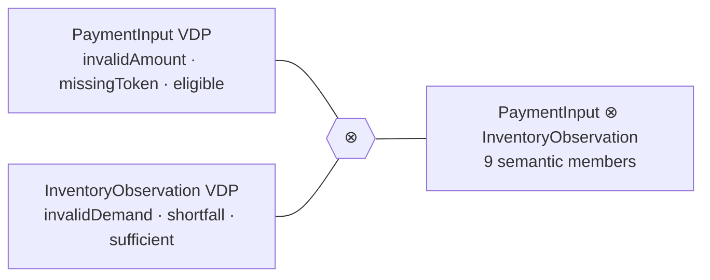
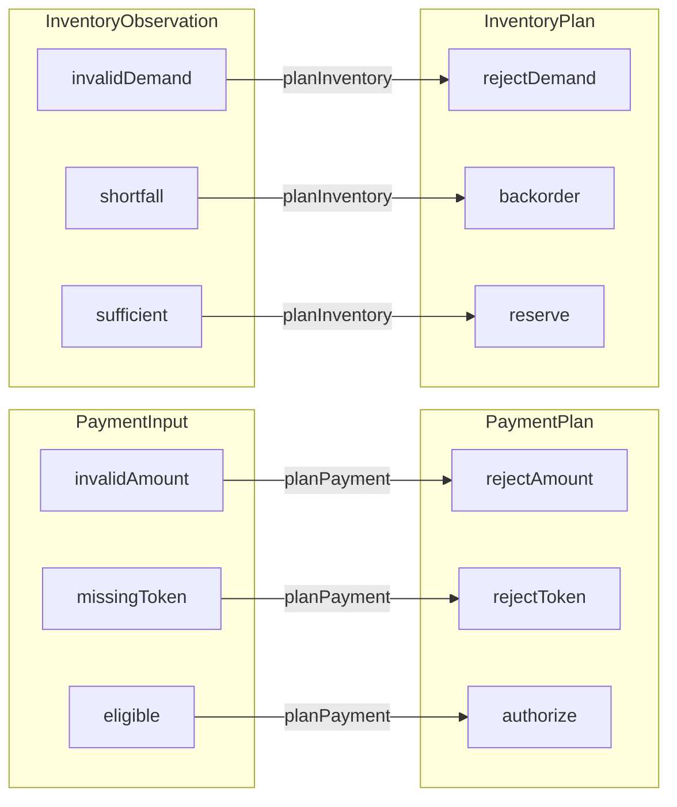
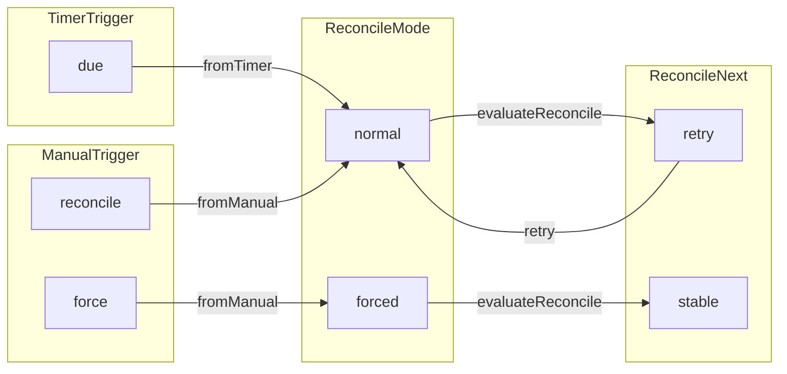
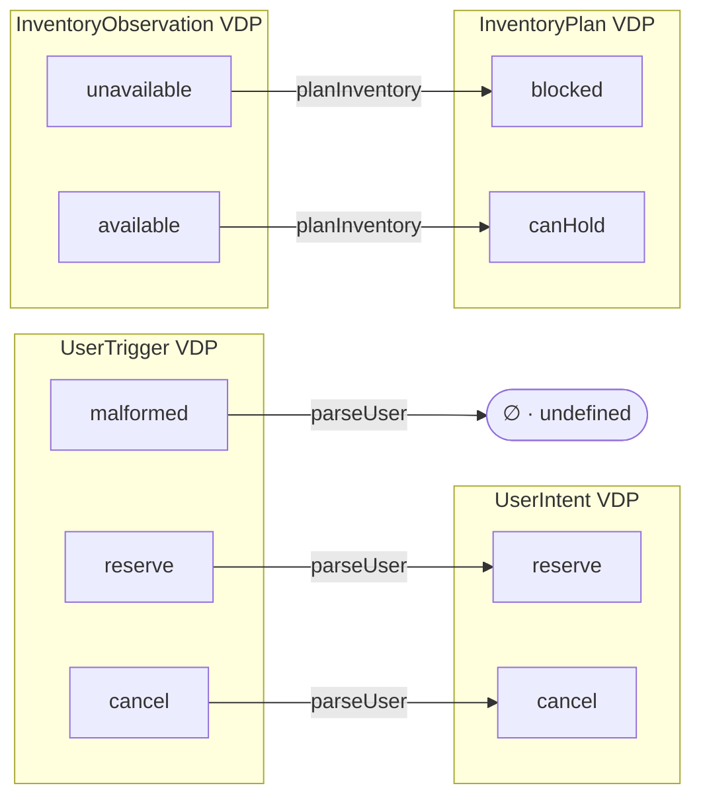
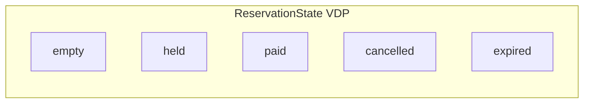
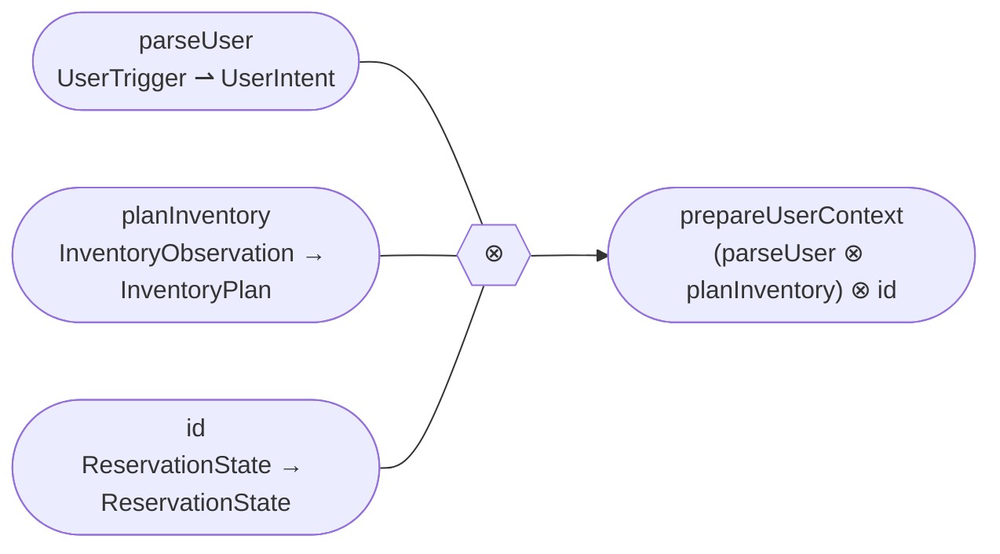
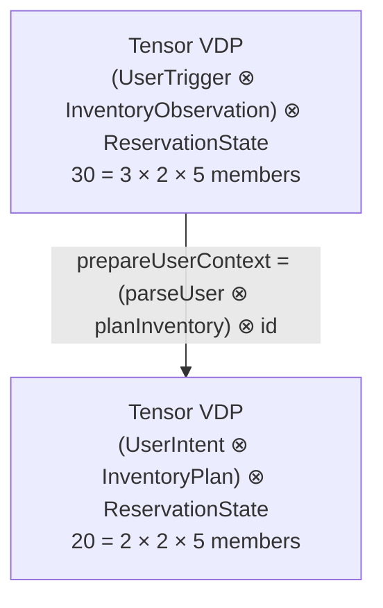
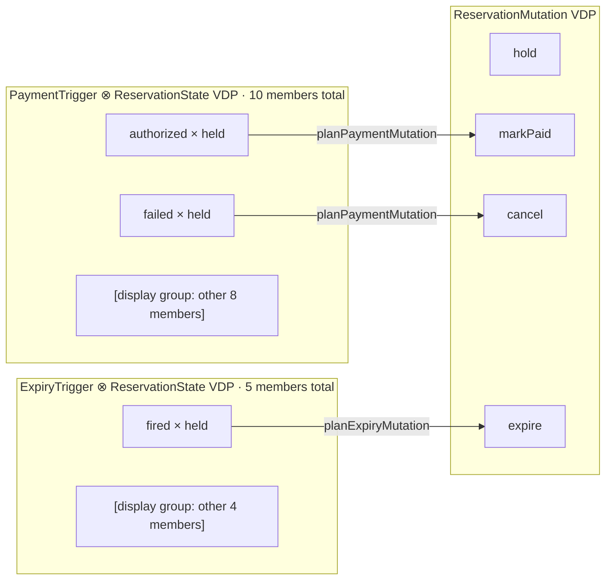
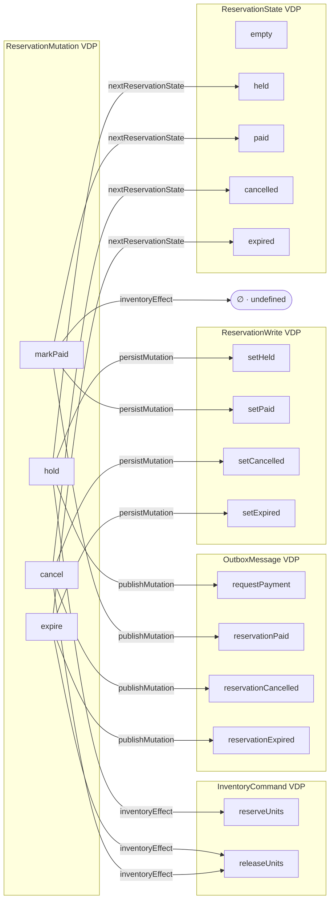

# ArchiScript

**Machine-checked architecture for AI-assisted software design.**

ArchiScript is a Lean library and an authoring discipline for making an
architecture precise before implementation. AI agents propose the model; Lean
checks the formal obligations of that model; engineers review whether it
actually describes the system.

Current release: **0.3.1**.

## The idea

ArchiScript models software architecture with a small calculus:

- a **carrier** is the full value universe considered at a boundary;
- a **Domain** is a semantic predicate over that carrier;
- a **VDP** is a finite partition into nonempty, disjoint, exhaustive semantic
  members;
- an **Operation** is a partial map between VDP member sets;
- `comp` is sequential composition;
- `tensor` combines independent VDPs and independent member maps;
- provenance, responsibility, bindings, evidence, findings, and approval live
  in the review/handoff layer.

Lean is not an architecture search engine and not a general model checker. It is
the executable implementation of **necessary correctness criteria for the
declared model**. A green proof means the stated obligations hold for the
carrier, predicates, mappings, and assumptions that were supplied. It does not
prove that the author chose the right requirements or that production code
conforms.

## Example: checkout

The checked
[checkout example](ArchiScriptExamples/Checkout.lean) is intentionally more than
an enum-to-enum toy. Its two input carriers exist independently of the semantic
cases we later select:

```text
PaymentRequest        = { amountCents : Nat, paymentToken : String }
InventoryObservation  = { requestedUnits : Nat, availableUnits : Nat }
```

They induce two separate VDPs:


```mermaid
flowchart LR
  P["PaymentInput VDP<br/>invalidAmount · missingToken · eligible"]
  I["InventoryObservation VDP<br/>invalidDemand · shortfall · sufficient"]
  T{{"⊗"}}
  J["PaymentInput ⊗ InventoryObservation<br/>9 semantic members"]

  P --- T
  I --- T
  T --- J
```

The undirected lines above mean **VDP construction**, not execution. Tensor keeps
the full product: no pair disappears because it looks inconvenient.

The individual members are then related by ordinary operations:


```mermaid
flowchart LR
  subgraph PIN["PaymentInput"]
    P0["invalidAmount"]
    P1["missingToken"]
    P2["eligible"]
  end

  subgraph POUT["PaymentPlan"]
    Q0["rejectAmount"]
    Q1["rejectToken"]
    Q2["authorize"]
  end

  subgraph IIN["InventoryObservation"]
    I0["invalidDemand"]
    I1["shortfall"]
    I2["sufficient"]
  end

  subgraph IOUT["InventoryPlan"]
    J0["rejectDemand"]
    J1["backorder"]
    J2["reserve"]
  end

  P0 -->|"planPayment"| Q0
  P1 -->|"planPayment"| Q1
  P2 -->|"planPayment"| Q2

  I0 -->|"planInventory"| J0
  I1 -->|"planInventory"| J1
  I2 -->|"planInventory"| J2
```

Those two member maps tensor into one operation between the product VDPs:

```lean
def planCheckoutFactors :
    Operation
      (paymentInputPartition.tensor inventoryObservationPartition)
      (paymentPlanPartition.tensor inventoryPlanPartition) :=
  planPayment.tensor planInventory
```

The next operation is deliberately **not** factorized. It makes a joint checkout
decision from the nine product members:


```mermaid
flowchart LR
  subgraph PLAN["PaymentPlan ⊗ InventoryPlan"]
    A0["rejectAmount × rejectDemand"]
    A1["rejectAmount × backorder"]
    A2["rejectAmount × reserve"]
    B0["rejectToken × rejectDemand"]
    B1["rejectToken × backorder"]
    B2["rejectToken × reserve"]
    C0["authorize × rejectDemand"]
    C1["authorize × backorder"]
    C2["authorize × reserve"]
  end

  subgraph ACTION["CheckoutAction"]
    R["rejectPayment"]
    V["rejectInventoryRequest"]
    W["waitForStock"]
    O["placeOrder"]
  end

  F["FulfillmentCommand<br/>submitOrder"]
  N(["∅ · undefined"])

  A0 -->|"chooseCheckoutAction"| R
  A1 -->|"chooseCheckoutAction"| R
  A2 -->|"chooseCheckoutAction"| R
  B0 -->|"chooseCheckoutAction"| R
  B1 -->|"chooseCheckoutAction"| R
  B2 -->|"chooseCheckoutAction"| R
  C0 -->|"chooseCheckoutAction"| V
  C1 -->|"chooseCheckoutAction"| W
  C2 -->|"chooseCheckoutAction"| O

  R -.->|"requestFulfillment"| N
  V -.->|"requestFulfillment"| N
  W -.->|"requestFulfillment"| N
  O -->|"requestFulfillment"| F
```

This one picture shows the three core ArchiScript ideas:

- **VDP members carry semantic distinctions**;
- **Operation arrows map those members explicitly**;
- **tensor preserves independent combinations**, while later operations may
  intentionally coarsen them.

The complete path is ordinary sequential composition after the tensor operation:

```lean
def decideCheckout :
    Operation
      (paymentInputPartition.tensor inventoryObservationPartition)
      checkoutActionPartition :=
  chooseCheckoutAction.comp planCheckoutFactors
```

`requestFulfillment` is partial: only `placeOrder` maps to
`submitOrder`. The undefined members say nothing by themselves about runtime
database, network, or queue effects.

## Concurrency review shapes

ArchiScript 0.3.1 does not prove races, but its topology can expose places that
deserve a concurrency review. The checked
[ConcurrencyQuestions example](ArchiScriptExamples/ConcurrencyQuestions.lean)
contains both independent fan-in and a retry cycle:


```mermaid
flowchart LR
  subgraph M["ManualTrigger"]
    M0["reconcile"]
    M1["force"]
  end

  subgraph T["TimerTrigger"]
    T0["due"]
  end

  subgraph R["ReconcileMode"]
    R0["normal"]
    R1["forced"]
  end

  subgraph N["ReconcileNext"]
    N0["retry"]
    N1["stable"]
  end

  M0 -->|"fromManual"| R0
  M1 -->|"fromManual"| R1
  T0 -->|"fromTimer"| R0

  R0 -->|"evaluateReconcile"| N0
  R1 -->|"evaluateReconcile"| N1
  N0 -->|"retry"| R0
```

The two incoming arrows to `ReconcileMode` come from **different source VDPs**,
so they represent independently available architectural triggers. That is a
useful review boundary if both paths later affect the same mutable resource.

The cycle

```text
ReconcileMode -> ReconcileNext -> ReconcileMode
```

is not a concurrency bug by itself; it is a sequential retry loop. The stronger
question appears when an independently sourced arrow can enter the same loop
while resource-changing work is in progress. At that point reviewers should ask
about ordering, atomicity, idempotency, or commutativity. Those runtime claims
remain `UNKNOWN` until resource/effect semantics or external evidence justify
them.

## Stateful stress example

The checked
[ReservationController example](ArchiScriptExamples/ReservationController.lean)
puts most of the calculus in one small system: independent triggers, tensor
composition, a shared logical state, partial operations, state transitions, and
several downstream effect contracts.

The diagrams follow the repository's existing review conventions: VDPs are
containers, members are nodes inside them, `∅` is outside every VDP, and
operation mappings are arrows. No custom palette is assigned; labels and shapes,
not colors, carry semantics.

### 1. Define the elementary VDPs and member maps

The factor operations are readable before any tensor is introduced.


```mermaid
flowchart LR
  subgraph UT["UserTrigger VDP"]
    U0["malformed"]
    U1["reserve"]
    U2["cancel"]
  end

  subgraph UI["UserIntent VDP"]
    UI0["reserve"]
    UI1["cancel"]
  end

  UX(["∅ · undefined"])

  subgraph IO["InventoryObservation VDP"]
    I0["unavailable"]
    I1["available"]
  end

  subgraph IP["InventoryPlan VDP"]
    IP0["blocked"]
    IP1["canHold"]
  end

  U0 -->|"parseUser"| UX
  U1 -->|"parseUser"| UI0
  U2 -->|"parseUser"| UI1

  I0 -->|"planInventory"| IP0
  I1 -->|"planInventory"| IP1
```

The shared state is another elementary VDP, not something manufactured by a
trigger:


```mermaid
flowchart LR
  subgraph RS["ReservationState VDP"]
    S0["empty"]
    S1["held"]
    S2["paid"]
    S3["cancelled"]
    S4["expired"]
  end
```

### 2. Tensor the independent operations without exploding the product map

The user path has three independent coordinates:

```text
parseUser     : UserTrigger          ⇀ UserIntent
planInventory : InventoryObservation → InventoryPlan
id            : ReservationState     → ReservationState
```

They are composed tensorially as one operation:

```lean
prepareUserContext =
  (parseUser.tensor planInventory).tensor
    (Operation.id reservationStatePartition)
```

The diagram deliberately leaves the component operations factored. Expanding
`prepareUserContext` into twenty Cartesian member arrows would add no new
architectural information: those arrows are already determined componentwise by
the three operations above.

This next picture is an **operation-algebra view**, not a VDP/member view.
Rounded nodes denote operations; there are deliberately no VDP containers in
this picture.


```mermaid
flowchart LR
  F1(["parseUser<br/>UserTrigger ⇀ UserIntent"])
  F2(["planInventory<br/>InventoryObservation → InventoryPlan"])
  F3(["id<br/>ReservationState → ReservationState"])
  T{{"⊗"}}
  OP(["prepareUserContext<br/>(parseUser ⊗ planInventory) ⊗ id"])

  F1 --- T
  F2 --- T
  F3 --- T
  T --> OP
```

Together they induce the following compact **Level 1 VDP topology**. Here each
box denotes one collapsed VDP; member detail is intentionally hidden because it
is mechanically determined by the factors.


```mermaid
flowchart TB
  SRC["Tensor VDP<br/>(UserTrigger ⊗ InventoryObservation) ⊗ ReservationState<br/>30 = 3 × 2 × 5 members"]
  DST["Tensor VDP<br/>(UserIntent ⊗ InventoryPlan) ⊗ ReservationState<br/>20 = 2 × 2 × 5 members"]

  SRC -->|"prepareUserContext = (parseUser ⊗ planInventory) ⊗ id"| DST
```

with `3 × 2 × 5 = 30` source members and `2 × 2 × 5 = 20` target
members. The full Cartesian products still exist; the diagram simply does not
force the reader to trace mechanically induced arrows one by one.

The next operation is different: `decideUserMutation` is genuinely
cross-factor policy and therefore is **not** decomposed into factor operations.

### 3. Independent triggers can observe the same state

Payment and expiry are independently available trigger VDPs. Their decision
operations consume different tensor contexts that both include the same
`ReservationState` factor.

This is a focused branch-map view: only members relevant to the review question
are shown. The omitted product members remain present; the operation is
undefined on them.


```mermaid
flowchart LR
  subgraph PC["PaymentTrigger ⊗ ReservationState VDP · 10 members total"]
    P0["authorized × held"]
    P1["failed × held"]
    POTHER["[display group: other 8 members]"]
  end

  subgraph EC["ExpiryTrigger ⊗ ReservationState VDP · 5 members total"]
    E0["fired × held"]
    EOTHER["[display group: other 4 members]"]
  end

  subgraph RM["ReservationMutation VDP"]
    M0["hold"]
    M1["markPaid"]
    M2["cancel"]
    M3["expire"]
  end

  P0 -->|"planPaymentMutation"| M1
  P1 -->|"planPaymentMutation"| M2
  E0 -->|"planExpiryMutation"| M3
```

The display-group boxes are **not new model members**; they only collapse
members that are present but uninteresting for this focused review. Concretely:

- `PaymentTrigger ⊗ ReservationState`: the other 8 members are
  `authorized × empty`, `authorized × paid`,
  `authorized × cancelled`, `authorized × expired`,
  `failed × empty`, `failed × paid`, `failed × cancelled`, and
  `failed × expired`;
- `ExpiryTrigger ⊗ ReservationState`: the other 4 members are
  `fired × empty`, `fired × paid`, `fired × cancelled`, and
  `fired × expired`.

The corresponding operations are undefined on every member in those display
groups. No edge is drawn from a VDP container to `∅`, because an operation is
defined on members, not on the container itself.

The concurrency review hotspot is now easy to read:

```text
authorized × held -> markPaid
fired      × held -> expire
```

Two independently sourced paths can observe the same semantic state member and
request incompatible updates. That is a strong review question, not a Lean
proof of a runtime race.

### 4. State transition and effects are ordinary operations

One mutation VDP fans out into several contracts. This is ordinary graph
fan-out, not tensor: there is one mutation coordinate, not several independent
copies of it.


```mermaid
flowchart LR
  subgraph RM["ReservationMutation VDP"]
    M0["hold"]
    M1["markPaid"]
    M2["cancel"]
    M3["expire"]
  end

  subgraph RS["ReservationState VDP"]
    S0["empty"]
    S1["held"]
    S2["paid"]
    S3["cancelled"]
    S4["expired"]
  end

  subgraph RW["ReservationWrite VDP"]
    W0["setHeld"]
    W1["setPaid"]
    W2["setCancelled"]
    W3["setExpired"]
  end

  subgraph OM["OutboxMessage VDP"]
    O0["requestPayment"]
    O1["reservationPaid"]
    O2["reservationCancelled"]
    O3["reservationExpired"]
  end

  subgraph IC["InventoryCommand VDP"]
    I0["reserveUnits"]
    I1["releaseUnits"]
  end

  IX(["∅ · undefined"])

  M0 -->|"nextReservationState"| S1
  M1 -->|"nextReservationState"| S2
  M2 -->|"nextReservationState"| S3
  M3 -->|"nextReservationState"| S4

  M0 -->|"persistMutation"| W0
  M1 -->|"persistMutation"| W1
  M2 -->|"persistMutation"| W2
  M3 -->|"persistMutation"| W3

  M0 -->|"publishMutation"| O0
  M1 -->|"publishMutation"| O1
  M2 -->|"publishMutation"| O2
  M3 -->|"publishMutation"| O3

  M0 -->|"inventoryEffect"| I0
  M1 -->|"inventoryEffect"| IX
  M2 -->|"inventoryEffect"| I1
  M3 -->|"inventoryEffect"| I1
```

The state cycle is semantic:

```text
ReservationState observation
        -> trigger context
        -> ReservationMutation
        -> nextReservationState
        -> ReservationState
```

There is deliberately no `ReservationWrite -> ReservationState` arrow. A
persistence request does not prove that a runtime write succeeded or that a
later observation changed.

Likewise,

```lean
persistMutation.tensor publishMutation
```

would be the wrong model for this fan-out: it would require two independent
`ReservationMutation` slots. Two ordinary arrows from the same mutation VDP
express the architecture correctly.

## 0.3.1 monoidal API

For VDPs `P` and `Q`, `Partition.tensor P Q` has carrier
`P.Carrier × Q.Carrier` and every pair of members. Even `P.tensor P` has two
independent carrier slots.

The public API includes:

```lean
#check Partition.tensor
#check Partition.unit
#check SemanticPartition.tensor

#check Operation.tensor
#check Operation.tensor_id
#check Operation.tensor_comp

#check Partition.tensorAssociator
#check Partition.tensorLeftUnitor
#check Partition.tensorRightUnitor
#check Partition.tensorSymmetry

#check Operation.associator_natural
#check Operation.leftUnitor_natural
#check Operation.rightUnitor_natural
#check Operation.symmetry_natural
#check Operation.pentagon
#check Operation.triangle
#check Operation.hexagon
```

Tensor is mathematically permissive. If `Account(A) ⊗ Payment(B)` is a strange
architectural combination, that is a **review question**, not a reason to mutate
or partially define tensor.

Tensor also does not mean runtime parallelism. Two branches of one operation are
ordinary alternatives of one partial map; they are not concurrent arrows.

## Core tooling

| Area | API |
| --- | --- |
| Semantic regions | `Domain`, complement, relative complement, `DomainDerivation` |
| VDPs | `Partition`, `HasMembers`, `SemanticPartition` |
| Boundary evidence | `CarrierOrigin`, `CarrierClosure`, `ArchitecturalPartition` |
| Sequential calculus | `Operation.id`, `Operation.comp` |
| Independent calculus | `Partition.tensor`, `SemanticPartition.tensor`, `Operation.tensor` |
| Coherence | associator, unitors, symmetry, naturality, pentagon, triangle, hexagon |
| Handoff | `Operation.Declaration`, `Operation.Registry`, canonical branch addresses |
| Routing | `ParameterizedPartition` |
| Review | `ReviewFinding`, `ReviewRecord`, revision-bound implementation gate |

## Modeling rules

Three rules prevent most bad models.

**Start from the carrier, not from desired outcomes.** Coverage proves coverage
of the carrier you declared. If malformed input, stale state, or relevant
environment context was omitted from the carrier, Lean cannot recover it.

**State semantic meaning independently of the classifier.** Member names are not
definitions. Define predicates first, then prove `Partition.HasMembers`.

**Keep member maps separate from effects.** `Operation X Y` is a partial map
between semantic members. It is not a database transaction, network request,
scheduler, or handler execution.

## Review and implementation handoff

ArchiScript keeps proof and engineering approval separate.

`ArchitecturalPartition` records carrier provenance and selected semantic
members. `Operation.Registry` gives stable operation and branch identities,
responsibility, implementation dispositions, source references, and evidence.
`ReviewRecord.implementationAllowed` becomes true only for an approved matching
revision with no open findings.

A compiling model is therefore not automatically an approved architecture.

## What ArchiScript does not claim

ArchiScript 0.3.1 does not:

- discover requirements omitted from the carrier;
- prove that an external system enforces a declared boundary guarantee;
- prove general production-code conformance;
- infer runtime effects from member arrows;
- model scheduler interleavings or liveness;
- automatically prove races, deadlocks, atomicity, or idempotency;
- treat tensor as common refinement or same-value synchronization;
- filter supposedly impossible tensor member pairs.

Use complementary formal tools when the problem requires temporal or distributed
behavior beyond this calculus.

## Examples

- [Checkout](ArchiScriptExamples/Checkout.lean) — multi-VDP tensor + sequential composition
- [PaymentWebhook](ArchiScriptExamples/PaymentWebhook.lean) — semantic decisions with observed ledger state
- [PaymentWebhookNetwork](ArchiScriptExamples/PaymentWebhookNetwork.lean) — connected multi-VDP architecture
- [FormInput](ArchiScriptExamples/FormInput.lean) — multiple resolutions of one carrier
- [UserRegistration](ArchiScriptExamples/UserRegistration.lean) — canonical branches and routing
- [Asphalt](ArchiScriptExamples/Asphalt.lean) — adversarial boundary/assumption stress test
- [Monoidal](ArchiScriptExamples/Monoidal.lean) — compact tensor/coherence example
- [ConcurrencyQuestions](ArchiScriptExamples/ConcurrencyQuestions.lean) — independent fan-in and retry-cycle review shapes
- [ReservationController](ArchiScriptExamples/ReservationController.lean) — tensor, shared state, independent triggers, partial effects, and same-resource update review

## Build

```sh
lake build
bash scripts/check-negative.sh
lake env lean skills/archiscript/examples/CurrentApi.lean
python -m unittest discover -s scripts -p "test_*.py"
node --test examples/payment-webhook.test.mjs
```

The required PR gate runs the same checks. See [CONTRIBUTING.md](CONTRIBUTING.md).

## AI skill

The repository includes an
[ArchiScript skill](skills/archiscript/SKILL.md) for AI agents. It teaches the
agent to audit carriers, define semantic predicates independently, use tensor
with full-product semantics, preserve assumptions and unknowns, resolve canonical
branch bindings, and keep architecture proof separate from code conformance.

The public API smoke test is
[skills/archiscript/examples/CurrentApi.lean](skills/archiscript/examples/CurrentApi.lean).

## Project status

ArchiScript deliberately builds on established mathematics. The experiment is
whether a small semantic architecture calculus, Lean-checked obligations, and
explicit human review improve AI-driven implementation by exposing omitted
cases and hidden assumptions before code is written.

See [CHANGELOG.md](CHANGELOG.md) for release history.

## License

Apache License 2.0. See [LICENSE](LICENSE).
