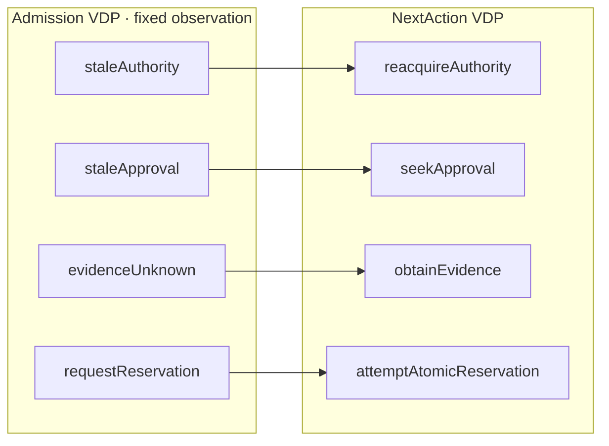

# Project Asphalt

An adversarial benchmark for ArchiScript, centered on a multi-region SaaS
deployment control plane. Its goal is to find where semantic precision becomes
misleading or too costly. A green Lean build is **not** a passing benchmark.

## Run the current slice

From the repository root:

```sh
node benchmarks/asphalt/run-benchmark.mjs
```

The runner builds [the Lean admission model](../../ArchiScriptExamples/Asphalt.lean),
runs the deterministic [control-plane fixtures](control-plane.test.mjs), checks
that their IDs match the [seeded-defect catalog](seeded-defects.json), and prints
observed counts, carrier-origin states, and opaque-subdomain warnings exported
from Lean. It does not run cloud analyzers or the four comparison arms.

## System boundary

A tenant asks to deploy one immutable artifact digest to a production environment
in a region. The control plane coordinates an admission decision, exclusive
ownership, scarce resource reservation, durable intent and event publication,
provider operations, callbacks, and regional write authority. The provider is a
fake adapter; leases, fencing, reservations, late callbacks, timeouts, and
unknown outcomes remain explicit.

The current Lean slice has **two admission VDPs, one upstream count-provenance
probe VDP, and one operation**. It is a deliberately small vertical slice, not
the target 25–40 VDP / 40–70 operation / 150–250 branch scale trial. The
operation maps ten admission members to ten requested actions.
Its ten canonical branches have checked whole-operation coverage; their
implementation disposition is explicitly `unimplemented`.
Its `requestReservation` target means *ask an allocator to attempt an atomic
reservation*. It neither grants resources nor authorizes production deployment.



The Lean carrier retains separate request, logical deployment, attempt, tenant,
artifact digest, lease epoch, policy revision, infrastructure revision, network
revision, schema revision, retry state, capacity observation, and evidence
references. `HasMembers` checks the selected predicates against the classifier.
`admissionArchitecture` explicitly marks that carrier as a trusted fixture
boundary; it does not establish completeness against production inputs. Its
supporting `externalScanPasses` subdomain is marked **opaque** because no
security-service result formula has been imported. The review must keep that
warning visible instead of promoting a scan reference to a passing result.
The signed-count probe preserves all `Int` inputs upstream and shows a checked
contract for narrowing to `Nat`; an absolute-value decoder fails that source
member claim. This checks the modeled decoder relation, not runtime conformance.
The classifier is scoped to *admission at a fixed observation*. Other outcome
relevant facts remain open obligations in the
[boundary ledger](boundary-ledger.md). No PVDP parameter is
introduced for runtime state; [Stage 2 scope](../../../archiscript-docs/chapter-1/stage-2/scope.md)
reserves parameterization for changes to outbound operation topology.

## What the checked model establishes

- The admission classifier covers its declared `Input` carrier with ten
  inhabited, disjoint members, and `HasMembers` connects independently stated
  predicates to its classifier.
- At this chosen resolution, a stale epoch asks for reacquisition rather than
  reservation; a changed artifact digest invalidates approval.
- Two observed checks can each see enough IPs while their joint demand exceeds
  capacity. The Lean arithmetic counterexample rejects `hasCapacity` as a
  reservation guarantee.
- A value-level decoder that emits a natural count only for nonnegative signed
  input supports a derived carrier claim; an absolute-value decoder does not.

It does **not** establish that the carrier contains all production facts,
that evidence references passed, that time observations are fresh, or that any
action was executed. Its ten-member precedence is a consumer policy that
engineers must review. For instance, `satisfied` takes precedence over a stale
approval; whether an already running deployment can be acknowledged under a
new policy is unresolved. That precedence is a benchmark finding, not a proof
of good policy.

### Known false-confidence trap in the current slice

The Lean model records CI, scan, and health *references* plus a network-analysis
revision observation. The `evidenceAddressable` predicate checks their presence and a network
revision match. A reference can point to a **failed** CI or security result.
Consequently the model may classify that input as `requestReservation`.
This is an intentional, documented benchmark failure: an evidence reference
cannot be upgraded into a passing observation. A production admission gate
would need addressable results, observed revisions, and a resolver that checks
them. Until then, the branch is conditional on external verification and must
not be presented as deployable.

The JavaScript `deploymentAdmission` fixture is a separate implementation
candidate, not a conformance proof for the Lean model. It likewise accepts
network evidence from an in-memory object. The network path test deliberately
shows why local `no public IP` reasoning is insufficient.

## Verification boundary

| Claim | Responsible check | Current status |
| --- | --- | --- |
| Semantic admission members and member mapping | Lean `HasMembers`, operation | Checked for this slice |
| No public Internet path to production DB | Network reachability analyzer over actual topology | Missing; AS-005 shows counterexample |
| Staging cannot reach production secrets | IAM and network graph analyzers | Missing |
| No two writers or lease owners under skew/failover | Temporal model checker and storage fencing | Deterministic fixture only; no distributed proof |
| Capacity safe under concurrent allocation | Atomic reservation backend | Deterministic fixture only |
| Terraform plan equals applied state | Plan/apply/observation revision comparison | Missing |
| CI, scan, approval and network claims passed at current revisions | Evidence resolver | Missing |
| Deployment health and DNS convergence | Runtime telemetry over an observation horizon | Missing |
| Code conforms to reviewed branches | Source resolution and integration tests | Missing |

The current `resolved` implementation disposition and free-form `EvidenceRef`
do not establish verified source existence or observed results. Asphalt treats
both as claims requiring checks.

## Seeded defects and ground truth

The catalog has 31 explicit defects. Nineteen have deterministic fixtures. The
remaining twelve are marked `pending` and retain their required oracle; they
must **not** be counted as caught. Passing a fixture means its fake adapter
demonstrated an expected behavior, not that ArchiScript found the defect. The
catalog deliberately assigns several cases to external analyzers, temporal
model checking, runtime observation, and human review.

The [evaluation protocol](protocol.md) defines comparison arms, scoring,
measurements, and kill criteria. It requires evaluators to score `UNKNOWN`
separately from a true detection. This prevents a large Lean model with green
proofs and missing runtime evidence from receiving a favorable score.

## Scale attack

The [state dimensions](state-dimensions.json) already imply
$6\times4\times4\times4\times3\times5\times4\times4=92{,}160$ naive
combinations; the runner measures that product and the checked branch count.
The product includes impossible or dependent combinations and is a pressure
metric, not a reachable-state count. The experiment should count **manually selected
members**, not only theoretical states. Different consumers may use different
partitions of the same carrier. Supporting predicates may overlap; selected
members must be exhaustive and disjoint. Flat partitions and safe coarsening
remain legitimate. If important downstream behavior distinguishes two values
inside a coarse member, that member must be split or the consumer must receive
an explicit value-level contract. No taxonomy tree is required.

The full scale trial must add real, independently defined membership predicates,
canonical branch IDs, implementation bindings, and focused review views before
claiming the 25–40 / 40–70 / 150–250 target. An inventory of enum names alone
would itself be a benchmark failure.

## Design basis

This example uses the current Lean API. It follows the original
[Stage 1 foundation](../../../archiscript-docs/chapter-1/stage-1/foundation.tex)
for VDPs and partial member mappings, and the
[Stage 2 design](../../../archiscript-docs/chapter-1/stage-2/scope.md)
for deductive carriers, observation context, and the PVDP boundary. Runtime
races are not converted into deterministic ArchiScript operations.
