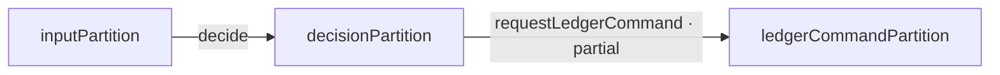
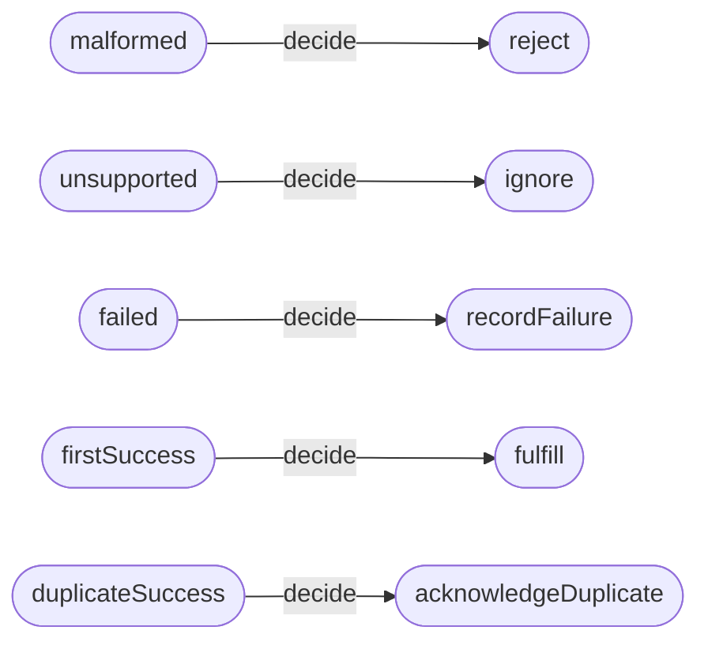

# PaymentWebhook engineering review pack

Model revision: `09c2b1ec5505`

Review state: **draft**

Implementation gate: **CLOSED**

This is a generated snapshot. Semantic mappings, members, responsibility, and code bindings come from Lean; review notes and findings come from structured review metadata. Approval belongs to the model revision above.

## Fast pass

### 1. Scope and direction

Webhook input classification, decision mapping, and ledger-command mapping in the companion example.

### 2. Changes since previous review

- First generated snapshot; no earlier projection supplied.

### 3. Boundary to challenge

**PaymentWebhook.Input** — Input combines eventId, status, and an alreadyRecorded Boolean supplied by a ledger observation.

**Review challenge:** Is the observation from a stable transaction or snapshot? Can concurrent deliveries change it before effects occur?

### 4. Operation topology

View: Level 1 — operation topology. Focus: input, decision, and ledger-command VDPs. Hidden: individual members, effects, and proofs.

The arrows are semantic member mappings, not runtime calls.

**Operation responsibility**

- `PaymentWebhook.decide`: payments-webhooks
- `PaymentWebhook.requestLedgerCommand`: payments-ledger

### 5. Major assumptions and open questions

- **PaymentWebhook.Input**: The model receives alreadyRecorded as a Boolean; its acquisition and consistency are not modeled.

- **PaymentWebhook.Input**: What guarantees that alreadyRecorded remains valid until the handler finishes?
- **PaymentWebhook.decide.duplicateSuccess**: Are duplicate acknowledgments required to be idempotent under concurrent delivery?
- **PaymentWebhook.decide.firstSuccess**: What recovery behavior is required if recording succeeds and queue publication fails?

## Deep pass

### 6. Semantic partitions

- `PaymentWebhook.inputPartition`: `malformed`, `unsupported`, `failed`, `firstSuccess`, `duplicateSuccess`
- `PaymentWebhook.decisionPartition`: `reject`, `ignore`, `recordFailure`, `fulfill`, `acknowledgeDuplicate`
- `PaymentWebhook.ledgerCommandPartition`: `recordFailure`, `recordAndQueueFulfillment`

The input carrier includes `alreadyRecorded`; the model does not establish how that observation was acquired.

Coarsening: none represented in this scoped review projection.

| Input member | Review meaning |
| --- | --- |
| `malformed` | eventId is empty, regardless of status or ledger observation |
| `unsupported` | eventId is present; status is neither success nor failed |
| `failed` | eventId is present; status is failed |
| `firstSuccess` | eventId is present; status is success; ledger observation is false |
| `duplicateSuccess` | eventId is present; status is success; ledger observation is true |

These descriptions sit beside the Lean predicates. The correspondence proof checks predicates against the classifier, not the English wording.

### 7. `decide` branch map

View: Level 2 — one operation. Focus: every declared `decide` branch. Hidden: predicate formulas and runtime effects.

| Canonical branch | Source | Target | Responsibility | Primary implementation |
| --- | --- | --- | --- | --- |
| `PaymentWebhook.decide.malformed` | `malformed` | `reject` | payments-webhooks | `archiscript:examples/payment-webhook.mjs#decide` (resolved) |
| `PaymentWebhook.decide.unsupported` | `unsupported` | `ignore` | payments-webhooks | `archiscript:examples/payment-webhook.mjs#decide` (resolved) |
| `PaymentWebhook.decide.failed` | `failed` | `recordFailure` | payments-webhooks | `archiscript:examples/payment-webhook.mjs#decide` (resolved) |
| `PaymentWebhook.decide.firstSuccess` | `firstSuccess` | `fulfill` | payments-webhooks | `archiscript:examples/payment-webhook.mjs#decide` (resolved) |
| `PaymentWebhook.decide.duplicateSuccess` | `duplicateSuccess` | `acknowledgeDuplicate` | payments-webhooks | `archiscript:examples/payment-webhook.mjs#decide` (resolved) |

### 8. Partial ledger mapping

| Decision member | Ledger-command member |
| --- | --- |
| `reject` | ∅ |
| `ignore` | ∅ |
| `recordFailure` | `recordFailure` |
| `fulfill` | `recordAndQueueFulfillment` |
| `acknowledgeDuplicate` | ∅ |

∅ means the operation is undefined for that member. It does not establish absence of unrelated runtime effects.

### 9. Effects and state assumptions

- **PaymentWebhook.requestLedgerCommand**: A mapping to none means no ledger-command member is requested. It does not prove the handler has no other runtime effects.
- **PaymentWebhook.decide.firstSuccess**: The companion handler records payment and then enqueues fulfillment; atomicity across those effects is not established. This example has no typed effect contract for that production sequence.

### 10. Responsibility, code, and evidence

| Canonical branch | Responsibility | Binding | Evidence references |
| --- | --- | --- | --- |
| `PaymentWebhook.decide.malformed` | payments-webhooks | `archiscript:examples/payment-webhook.mjs#decide` (resolved) | all declared input members map to their checked decisions |
| `PaymentWebhook.decide.unsupported` | payments-webhooks | `archiscript:examples/payment-webhook.mjs#decide` (resolved) | all declared input members map to their checked decisions |
| `PaymentWebhook.decide.failed` | payments-webhooks | `archiscript:examples/payment-webhook.mjs#decide` (resolved) | all declared input members map to their checked decisions |
| `PaymentWebhook.decide.firstSuccess` | payments-webhooks | `archiscript:examples/payment-webhook.mjs#decide` (resolved) | first success records payment and enqueues fulfillment |
| `PaymentWebhook.decide.duplicateSuccess` | payments-webhooks | `archiscript:examples/payment-webhook.mjs#decide` (resolved) | duplicate success acknowledges without ledger or queue effects |
| `PaymentWebhook.requestLedgerCommand.recordFailure` | payments-ledger | `archiscript:examples/payment-webhook.mjs#requestLedgerCommand` (resolved) | first success records payment and enqueues fulfillment |
| `PaymentWebhook.requestLedgerCommand.fulfill` | payments-ledger | `archiscript:examples/payment-webhook.mjs#requestLedgerCommand` (resolved) | first success records payment and enqueues fulfillment |

### 11. Machine-checked claims

- inputPartition realizes inputRegions — `PaymentWebhook.inputPartition_realizes_regions`
- requestLedgerCommand.comp decide maps firstSuccess to recordAndQueueFulfillment — `PaymentWebhook.first_success_requests_fulfillment`
- requestLedgerCommand.comp decide maps duplicateSuccess to none — `PaymentWebhook.duplicate_requests_no_ledger_command`

Conditional claims: none exported in this scoped review projection. The effect and concurrency questions below remain unknown.

These claims concern the declared model. Evidence references are not conformance proofs.

### 12. Unknowns and review findings

- **PaymentWebhook.Input**: What guarantees that alreadyRecorded remains valid until the handler finishes?
- **PaymentWebhook.decide.duplicateSuccess**: Are duplicate acknowledgments required to be idempotent under concurrent delivery?
- **PaymentWebhook.decide.firstSuccess**: What recovery behavior is required if recording succeeds and queue publication fails?

| Finding | Subject | Concern | Required change | Disposition |
| --- | --- | --- | --- | --- |
| `RV-1` | `PaymentWebhook.Input` | The alreadyRecorded Boolean is modeled without a snapshot or transaction boundary. | An engineer should confirm the consistency guarantee or request an explicit concurrency assumption or revised carrier. | open |
| `RV-2` | `PaymentWebhook.decide.firstSuccess` | The model names a record-and-queue command but does not specify recovery after a successful record and failed queue publication. | An engineer should confirm the delivery guarantee and request an effect contract or compensating behavior if required. | open |

### 13. Approval record

- State: `draft`
- Reviewer: none
- Approved model revision: none
- Implementation allowed by review gate: **no**

### Appendix: source anchors

- `ArchiScript/Examples/PaymentWebhook.lean`: carrier, partitions, operations, registry, and checked claims
- `ArchiScript/Operation.lean`: canonical branch and implementation-binding API
- `review/payment-webhook.review.json`: review notes, findings, and approval state
