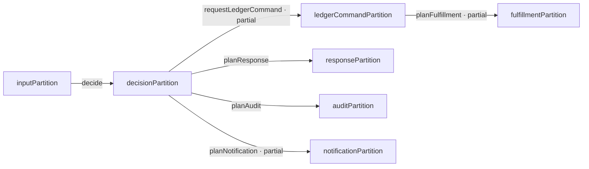
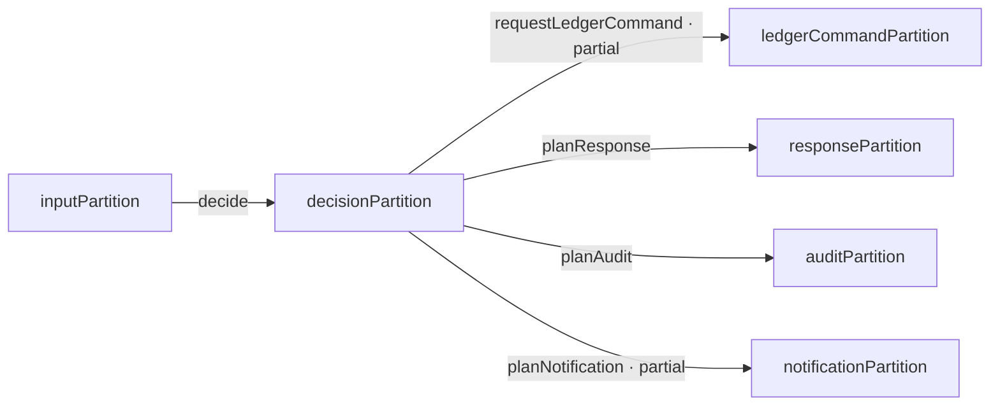
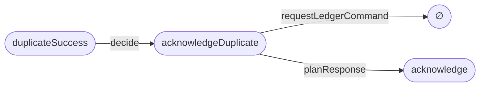
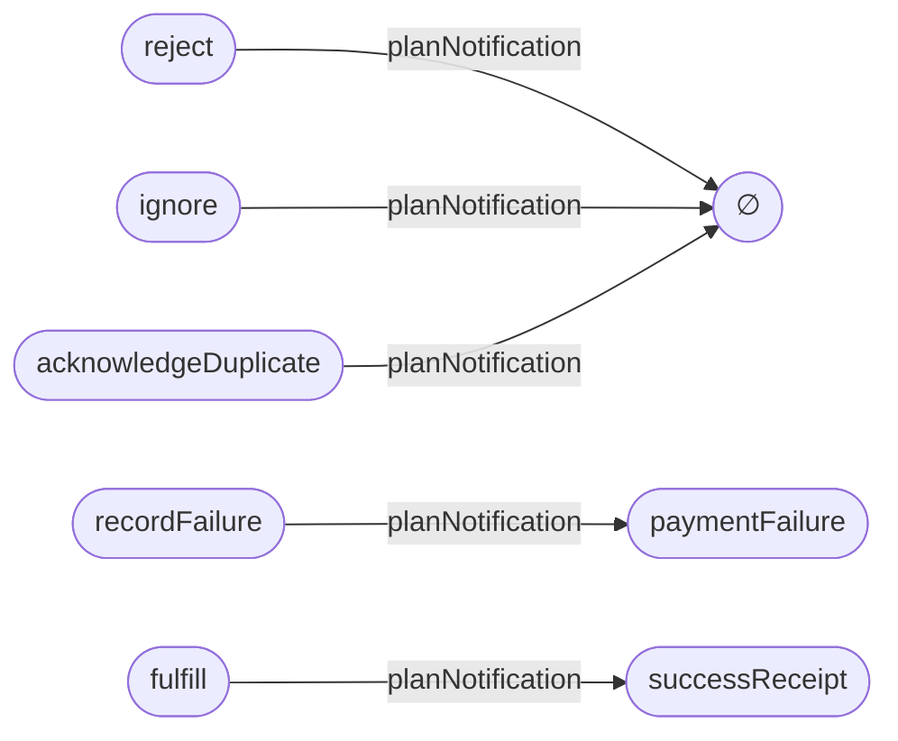

# PaymentWebhookNetwork: one model, several review views

Model revision: `f0c0290e6912`

Review state: **draft** · implementation gate: **CLOSED**

A connected webhook decision architecture with provider response, audit, notification, ledger-command, and fulfillment-request plans.

These are read-only projections of the Lean model. Arrows map semantic members; they are not runtime calls.

## Level 1 · Entire operation topology

**Question:** Which VDPs connect? **Hidden:** member mappings, effects, and code sites.

Seven VDPs and six operations fit the overview budget. The four outputs of `decisionPartition` are distinct review obligations, not execution stages.

## Level 1 · Decision neighborhood

**Question:** What enters and leaves `decisionPartition`? **Hidden:** the downstream fulfillment branch and unrelated member detail.

## Focused composition · Duplicate delivery

**Question:** How can the duplicate receive a provider response without a ledger command? **Hidden:** audit intent, notification intent, other branches, and runtime effects.

`∅` means `requestLedgerCommand` is undefined for `acknowledgeDuplicate`. It does not prove absence of other runtime effects.

## Level 2 · Complete notification branch map

**Question:** Which decisions request customer notification? **Hidden:** other operations and code effects.

| Decision member | Notification intent |
| --- | --- |
| `reject` | ∅ |
| `ignore` | ∅ |
| `recordFailure` | `paymentFailure` |
| `fulfill` | `successReceipt` |
| `acknowledgeDuplicate` | ∅ |

## Level 3 · Input partition under review

The carrier is the same event-plus-ledger-observation boundary as the base PaymentWebhook model.

| Selected member | Review description |
| --- | --- |
| `PaymentWebhookNetwork.inputPartition.malformed` | eventId is empty, regardless of status or ledger observation |
| `PaymentWebhookNetwork.inputPartition.unsupported` | eventId is present; status is neither success nor failed |
| `PaymentWebhookNetwork.inputPartition.failed` | eventId is present; status is failed |
| `PaymentWebhookNetwork.inputPartition.firstSuccess` | eventId is present; status is success; ledger observation is false |
| `PaymentWebhookNetwork.inputPartition.duplicateSuccess` | eventId is present; status is success; ledger observation is true |

The descriptions sit beside independent Lean predicates. Lean checks predicate/classifier correspondence, not the English wording or the adequacy of the chosen boundary.

## Level 4 · Branch-to-code handoff

| Canonical branch | Responsibility | Primary implementation |
| --- | --- | --- |
| `PaymentWebhookNetwork.decide.duplicateSuccess` | payments-webhooks | `archiscript:examples/payment-webhook.mjs#decide (resolved)` |
| `PaymentWebhookNetwork.planResponse.acknowledgeDuplicate` | payments-api | `archiscript:examples/payment-webhook-network.mjs#planResponse (planned)` |
| `PaymentWebhookNetwork.planAudit.acknowledgeDuplicate` | payments-audit | `archiscript:examples/payment-webhook-network.mjs#planAudit (planned)` |
| `PaymentWebhookNetwork.planFulfillment.recordAndQueueFulfillment` | fulfillment | `archiscript:examples/payment-webhook-network.mjs#planFulfillment (planned)` |

The base `decide` binding is resolved in companion code. New output-plan bindings are planned paths; those files do not exist yet. Neither state proves code conformance.

## Checked claims and review findings

**PROVED over the declared model**

- inputPartition realizes independently stated inputRegions — `PaymentWebhook.inputPartition_realizes_regions`
- duplicateSuccess has an acknowledge response plan — `PaymentWebhookNetwork.duplicate_acknowledged`
- duplicateSuccess has no notification mapping — `PaymentWebhookNetwork.duplicate_has_no_notification_intent`
- duplicateSuccess has no fulfillment-request mapping — `PaymentWebhookNetwork.duplicate_requests_no_fulfillment`
- firstSuccess maps to an enqueue request — `PaymentWebhookNetwork.first_success_requests_fulfillment`

**UNKNOWN / OPEN**

- `PaymentWebhookNetwork.inputPartition`: Which transaction or snapshot fixes alreadyRecorded while concurrent deliveries are processed?
- `PaymentWebhookNetwork.planNotification`: Should a first successful delivery request a receipt before fulfillment is durably queued?
- `PaymentWebhookNetwork.planResponse`: Does provider acknowledgment depend on a successful ledger transaction, making Decision alone an insufficient source?
- `PaymentWebhookNetwork.planFulfillment`: What recovery rule applies if payment recording succeeds but fulfillment enqueue fails?

| Finding | Subject | Concern | Status |
| --- | --- | --- | --- |
| `NW-1` | `PaymentWebhookNetwork.inputPartition` | The Boolean ledger observation has no stated concurrency guarantee. | open |
| `NW-2` | `PaymentWebhookNetwork.planFulfillment` | A fulfillment request is modeled, but queue publication and recovery are not specified or proved. | open |

The output VDPs describe plans. The model does not establish that any HTTP response, audit record, notification, ledger write, or queue publication occurs atomically or at all.

## Source anchors

- `ArchiScript/Examples/PaymentWebhookNetwork.lean`: new VDPs, operations, canonical registry, and path proofs
- `ArchiScript/Examples/PaymentWebhook.lean`: input semantics and the base decision/ledger operations
- `review/payment-webhook-network.review.json`: draft review questions and findings
