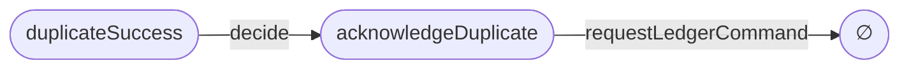

# Human review projections

Choose one question before drawing. Read the current Lean declarations and
proofs, then project only facts established there. A Mermaid diagram is a
read-only view, never another source of architectural semantics. State the
view's **level**, **focus**, and **hidden detail** above or below the graph.

| Level | Review question | Show | Hide |
| --- | --- | --- | --- |
| 0 — boundary | What enters the system? | External appearances, major VDPs and boundaries | Members, branches, proofs, source lines |
| 1 — topology | Which VDPs are connected? | VDPs and canonical operation names; partial nature, responsibility and primary code in nearby text | Individual members |
| 2 — branch map | What does one operation do? | Every relevant source member and its target or `∅`; selective branch metadata | Unrelated operations and supporting predicates |
| 3 — partition | Are distinctions sound? | Carrier, supporting predicates, selected members, and any coarsening | Operation flow and code |
| 4 — implementation | Where is one path implemented, and what is established? | Selected branch/path, primary and supporting code, evidence and unknowns | Entire registry |

Use Level 0 for scope/product review, Level 1 for architecture review, Level 2
for one operation, Level 3 for carrier or partition review, and Level 4 for
implementation review. For path equality or composition questions, draw the
focused path or two-path comparison at the needed level. Level 0 should fit on
one screen. Prefer at most eight major nodes; split above twelve. A Level 2 map
normally covers one operation. A Level 4 view normally covers one path or a
comparison of two paths.

Mermaid conventions: rectangles for VDPs, rounded nodes for members, a distinct
boundary shape for external appearances, and labeled arrows for semantic
operations. Put long source locations and evidence outside the graph. Labels,
not colors, carry meaning. Display canonical names, optionally after a human
label such as `Duplicate successful delivery [duplicateSuccess]`. If several
members are collapsed, label the aggregate `[display group: ...]` and list its
members in the caption; never treat the group as a new model member.

An ArchiScript arrow is a member mapping, not a runtime call. If code or call
information is necessary, use a separate **Implementation binding** section.
For partial operations, show relevant `∅` outcomes and include the legend:
`∅ = operation undefined for this member; it does not assert absence of
unrelated runtime effects.` Do not infer a side-effect guarantee from `none`.

Put epistemic status beneath the diagram, rather than adding nodes:

```text
Assumptions
- ledger observation concerns one decision snapshot

Proved
- requestLedgerCommand.comp decide maps duplicateSuccess to none

Unknown
- production handler has no other side effect
```

For example, the checked `PaymentWebhook` composition can be projected as:



View: focused composition. Focus: whether a duplicate success requests a
ledger command. Hidden: other input members, supporting predicates, production
effects. The theorem establishes the member mapping only. The companion
implementation binding belongs in a separate Level 4 view; it does not change
what this arrow means.
