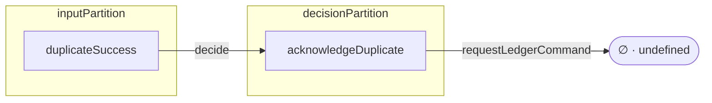

# Human review projections

Choose one question before drawing. Read the current Lean declarations and
proofs, then project only facts established there. A Mermaid diagram is a
read-only view, never another source of architectural semantics. State the
view's **level**, **focus**, and **hidden detail** above or below the graph.

| Level | Review question | Show | Hide |
| --- | --- | --- | --- |
| 0 — boundary | What enters the system? | External appearances, major VDPs and boundaries | Members, branches, proofs, source lines |
| 1 — topology | Which VDPs are connected? | VDPs and canonical operation names; partial nature, responsibility and primary code in nearby text | Individual members |
| 2 — branch map | What does one operation do? | Every relevant source member and its target or `∅`; selective branch metadata | Unrelated operations and supporting predicates |
| 3 — partition | Are distinctions sound? | Carrier provenance; supporting subdomain bases and formulas or opaque status; selected members and any coarsening | Operation flow and code |
| 4 — implementation | Where is one path implemented, and what is established? | Selected branch/path, primary and supporting code, evidence and unknowns | Entire registry |

Use Level 0 for scope/product review, Level 1 for architecture review, Level 2
for one operation, Level 3 for carrier or partition review, and Level 4 for
implementation review. For path equality or composition questions, draw the
focused path or two-path comparison at the needed level. Level 0 should fit on
one screen. Prefer at most eight major nodes; split above twelve. A Level 2 map
normally covers one operation. A Level 4 view normally covers one path or a
comparison of two paths.

Mermaid and TikZ conventions: draw each VDP as a labeled container box and
its selected members as boxes inside it. Connect member boxes with arrows for
semantic operation mappings. Draw `∅` outside every VDP, since it is not a
member. At Level 1, a VDP may appear as one collapsed box because individual
members are intentionally hidden. Reserve VDP containers/subgraphs for actual
VDPs; do not reuse that container grammar merely to group operations or tensor
factors. For an operation-algebra view, use operation-shaped nodes and label the
view explicitly so those nodes cannot be mistaken for VDPs or members. Use a
distinct boundary shape for external appearances. Put long source locations and
evidence outside the graph. Follow the repository's established/default diagram
theme rather than hard-coding semantic colors: labels, containment, shapes, and
arrow direction carry meaning. Display canonical names, optionally after a
human label such as `Duplicate successful delivery [duplicateSuccess]`. If
several members are collapsed, label the aggregate
`[display group: ...]` and list its members in the caption; never treat the
group as a new model member.

At Level 3, show supporting subdomains beside the VDP, with their base,
containment relationship, and defining formula when available. Label an opaque
subdomain `OPAQUE` and give its reason. Supporting subdomains may overlap and
need not exhaust the carrier; do not draw them as selected member boxes unless
the VDP actually selects them. Show whether carrier provenance is an
architecture-defined domain or a trusted external premise. Constructor closure
is separate evidence inside a carrier. Neither a formula label
nor a diagram proves that an external predicate is enforced at runtime.

At Level 1, a VDP-to-VDP arrow summarizes one canonical operation on member
sets. At Level 2, an arrow connects one source member to its mapped target.
Neither arrow is a runtime call. If code or call information is necessary, use
a separate **Implementation binding** section.

Several outgoing arrows from one VDP form fan-out and carry no ordering relation
between those operations. They may be implemented sequentially or in parallel;
the diagram proves neither. By contrast, a modeled sequential chain must pass
through an intermediate VDP, such as `A -> B -> C`, making the target of the
first operation the source of the next.

In 0.5.0, an `Expression` may retain that composition syntax while denoting
the single composite `Operation A C`. Composition does not remove `B` from
the architecture category. If a diagram intentionally omits nominal `B` and
shows only `A -> C`, label the view as an **architecture projection** and
state that the intermediate VDP is hidden. Do not present that omission as a
normalization theorem that deleted `B`.
For partial operations, show relevant `∅` outcomes and include the legend:
`∅ = operation undefined for this member; it does not assert absence of
unrelated runtime effects.` Connect `∅` only from a member whose mapping is
being shown; never draw a VDP-container-to-`∅` edge. Do not infer a side-effect
guarantee from `none`.

For a tensor view, show the elementary factor VDPs first. Use unoriented lines
from the factors into a `⊗` constructor node and a directed edge from that node
to the constructed product:

```text
P ---┐
     ⊗ --▶ P ⊗ Q
Q ---┘
```

The arrowhead is a visual reading aid for **object construction**, not a
morphism. Do not draw arrows `P -> P ⊗ Q` or `Q -> P ⊗ Q`: tensor has no
canonical injections. A product VDP has all factor-member tuples; a focused view
may hide product tuples only when it states the omitted detail and never suggests
pruning. If a product VDP has `n` members but only `k` are expanded, label the
VDP with its total cardinality and account for the remaining `n-k` explicitly,
for example `[display group: other 8 members]`. Such a display group is never a
model member; list the collapsed members in the caption or nearby text.
`P ⊗ P` still has two slots.

For a tensor **operation**, prefer the factored presentation. In a VDP view,
show the elementary factor operations independently and state that they induce
`f ⊗ g : P ⊗ Q → P′ ⊗ Q′`. In a dedicated operation-algebra view, represent
`f`, `g`, and `f ⊗ g` as operation-shaped nodes rather than placing them
inside VDP-like subgraphs. Do not expand the induced Cartesian family of member
arrows unless that exact branch-level mapping is the review question. The
compact factored view carries the same componentwise rule and scales much
better. It does not claim runtime parallel execution.

For a **coproduct construction view**, use the same structural grammar:

```text
P ---┐
     ⊕ --▶ P ⊕ Q
Q ---┘
```

The incoming summand lines are structural and have no arrowheads. The outgoing
arrowhead marks the direction in which the object is constructed; it is not an
`Operation`.

Do not call those structural lines coproduct injections. When the categorical
injections themselves are relevant, draw the actual Operations separately:

```text
P ──ι₁──▶ P ⊕ Q
Q ──ι₂──▶ P ⊕ Q
```

Coproduct is appropriate only when those alternatives are closed by architecture
at design time; do not use the diagram to imply that runtime-discovered cases
form an exhaustive external boundary.

For an **expression-family view**, show the common source once and draw each
selected expression to its own target. This is the preferred presentation for
fan-out consequences of one architectural question:

```text
                 ┌──e₁──▶ T₁
S ───────────────┼──e₂──▶ T₂
                 └──e₃──▶ T₃
```

Every `eᵢ` still has exactly one source and one target. The family does not
create a multi-target morphism, does not tensor the targets, and does not impose
order between sibling expressions.

When a local normalization changes only expression syntax, it may be annotated
with the law or certificate that justifies it. For example:

```text
A ──ι₁──▶ A ⊕ B ──[f,g]──▶ C
          normalizes by [f,g] ∘ ι₁ = f
A ─────────────f──────────▶ C
```

This is branch-relative expression simplification. Do not erase the nominal
`A ⊕ B` VDP from a whole-architecture view merely because one selected
expression simplifies through the left injection.

For a **distributive normalization view**, show both structural source forms and
the explicit isomorphism rather than drawing them as equal:

```text
(A ⊗ R) ⊕ (B ⊗ R)  ──≅──▶  (A ⊕ B) ⊗ R
```

Caption the factored form as one shared structural `R` coordinate across the
two alternatives. Do not translate that fact into "one read", "one request",
"one transaction", or "one runtime instance". Conversely, a source
`A ⊗ R ⊗ R` contains two independent `R` slots and should remain visibly
different.

Dependency/provenance graphs are derived views. A tensor factor required in a
materialized family source can be shown as an independent dependency, but a VDP
merely appearing as another coproduct summand is not automatically a
dependency. Ask "which family can produce S?" only after the view has
established that the current family requires `S`; keep alternative producers
visible rather than collapsing them into a direct family-to-family edge.

For a **resolution view**, show the fine VDP and coarse VDP as distinct VDPs on
the same carrier, with the coarsening map `q` labeled explicitly. If a consumer
is drawn from the coarse VDP, the model must contain a factorization proof
`f = g ∘ q`. If factorization fails, do not draw `g` as though it existed;
show the fine consumer and annotate the concrete fiber conflict instead. This
distinguishes checked semantic zoom from a display-only grouping.

For a comprehensive stress-test projection, it is acceptable to exceed the
ordinary eight-node preference when one diagram is specifically intended to
show how the calculus composes. Keep mechanically induced product members
collapsed, but include the distinct algebraic structures that matter:
sequential composition, tensor, coproduct, partiality, coarsening, successful
and rejected factorization, expression-family fan-out, distributive source
factoring, and the normalization/projection distinction when the model supplies
them. The repository's canonical example is
`ArchiScriptExamples/ReservationController.lean`.

Normalize factor-only review questions across associator, unitors, and
symmetry: `(P ⊗ Q) ⊗ R` and `P ⊗ (Q ⊗ R)` must not receive different joint-use
findings merely because of parentheses. Swapped factors should preserve a
question that has no explicit role or ordering dependence. For an odd-looking
product, ask why the factors are jointly relevant; retain the mathematically
valid tensor. Multiple branches of one operation are alternatives, while
multiple arrows from independent sources can raise an ordering question.
Neither graph fan-in nor a cycle proves a race without resource/effect evidence.

Put epistemic status beneath the diagram, rather than adding nodes:

```text
Assumptions
- ledger observation concerns one decision snapshot

Proved
- requestLedgerCommand.comp decide maps duplicateSuccess to none

Unknown
- production handler has no other side effect
```

For example, the checked `PaymentWebhook` composition can be projected as:


```mermaid
flowchart LR
    subgraph INPUT["inputPartition"]
        A["duplicateSuccess"]
    end
    subgraph DECISION["decisionPartition"]
        B["acknowledgeDuplicate"]
    end
    C(["∅ · undefined"])
    A -->|"decide"| B
    B -->|"requestLedgerCommand"| C
```

View: focused composition. Focus: whether a duplicate success requests a
ledger command. Hidden: other input members, supporting predicates, production
effects. The theorem establishes the member mapping only. The companion
implementation binding belongs in a separate Level 4 view; it does not change
what this arrow means.